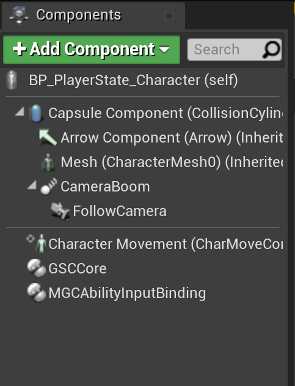
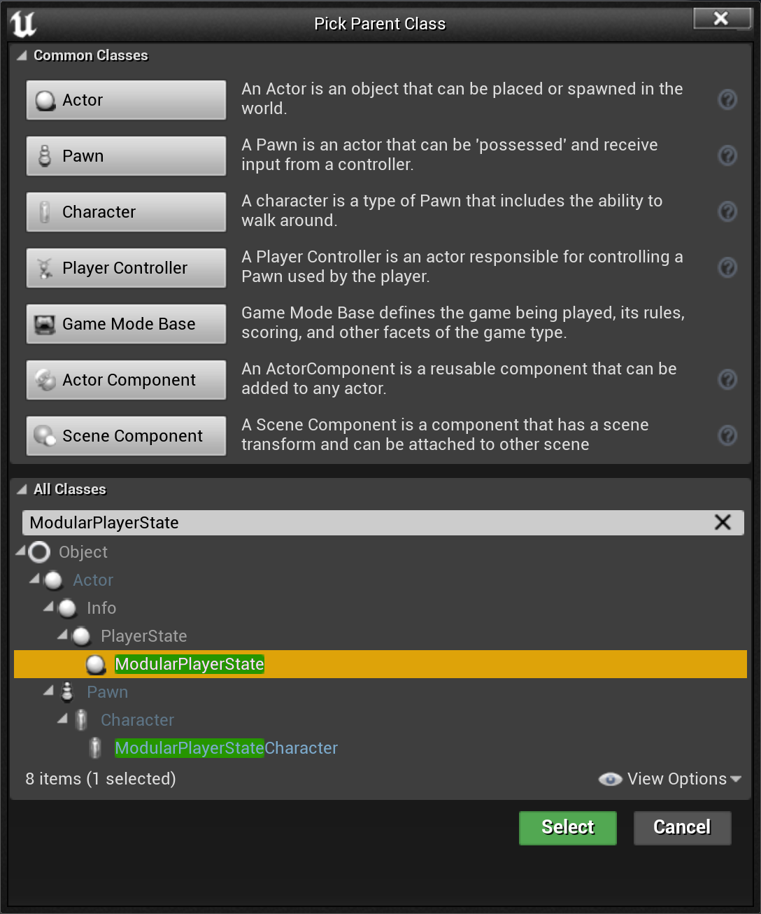
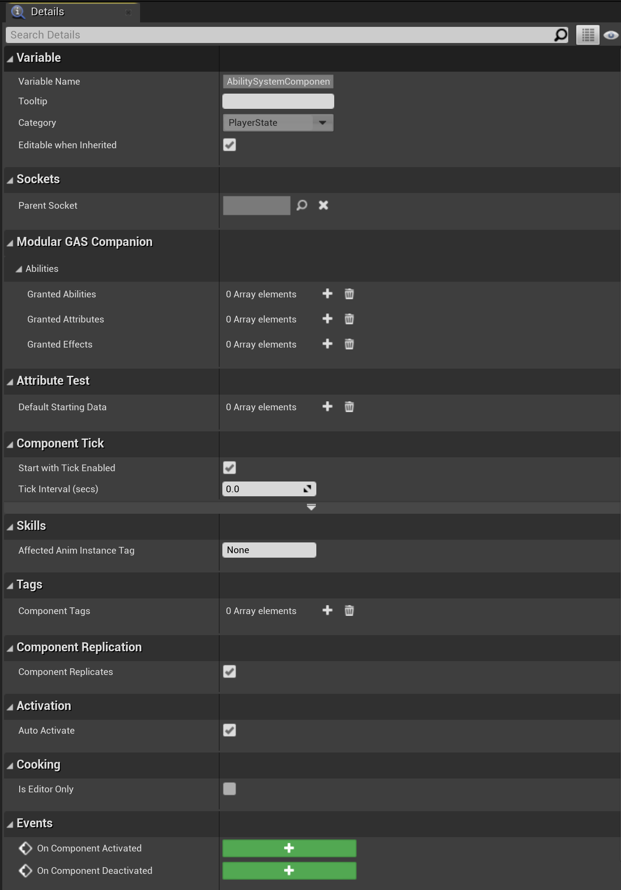
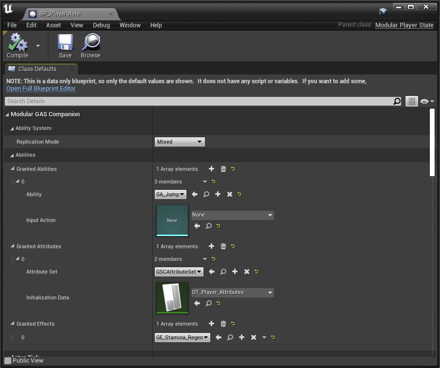

This page describes the minimal amount of setup to do with GAS Companion for ASC living on Player State. It is a direct follow-up of the [Quick Start]({{ "/quick-start" | url }}) page where we setup the project to use an ASC living on the player character.

## Recommended reading

Ability System Component (ASC) from GAS defines the concept of Owner and Avatar actor. It is recommended to read through [4.1 section of Tranek's GAS Documentation on GitHub](https://github.com/tranek/GASDocumentation#41-ability-system-component) which explains the concept really well. Setting up the the ASC to live on Player States basically involves setting up the Owner Actor to be the Player State, and Avatar Actor to be the Character or Pawn.

**What is then the recommended setup to use regarding ASC living on Player State or Characters / Pawns ?**

Well, there is a section at the bottom of GAS Documentation readme with excerpts from a Q&A session with Epic Game's Dave Ratti which includes a question covering this topic:

> Q: We know that the AbilitySystemComponent lives on the PlayerState in Paragon and Fortnite and on the Character in the Action RPG Sample. What are Epic’s internal rules, guidelines, or recommendations for where the AbilitySystemComponent should live --what should its Owner be?

> A: In general I would say anything that does not need to respawn should have the Owner andAvatar actor be the same thing. Anything like AI enemies, buildings, world props, etc.

> Anything that does respawn should have the Owner and Avatar be different so that the Ability System Component does not need to be saved off / recreated / restored after a respawn.. PlayerState is the logical choice it is replicated to all clients (where as PlayerController is not). The downside is PlayerStates are always relevant so you can run into problems in 100 player games. (See notes on what FN did in question #3).

> ~ https://github.com/tranek/GASDocumentation#111-qa-with-epic-games-dave-ratti

> ~ https://epicgames.ent.box.com/s/m1egifkxv3he3u3xezb9hzbgroxyhx89

## Overview

### Demo Project

***Note***: *You can download this [4.27 project](https://drive.google.com/file/d/1XAeUp4MPhBxhPQHitaNJ93DD0awcnDTv/view) which contains the bare minimum amount of setup in a BP only project to have the ASC living on Player State with GAS Companion `3.x.x` version.*

This page will go over how to do the same in a blank project based on the third person template.

### Summary

Game Mode Setup for ASC living on PlayerState: 

- **Pawn**: `GSCModularPlayerStateCharacter` (bp child of it)
- **Controller**: `GSCModularPlayerController`
- **PlayerState**: `GSCModularPlayerState` (bp child of it)

`GSCModularPlayerStateCharacter` does not have ASC and forwards to the player state. If you need to edit values of the ASC (for instance granting abilities), you'll need to make a BP child of the player state. `GSCAbilitySystemComponent` will be available there.

If you need to interact with ASC from your Character:

- You can call `GetAbilitySystemComponent` with your actor, it should return the ASC living on PlayerState.
- You can add `GSCCoreComponent` as an actor component on your character and the exposed API (methods, events, etc.) should behave as if ASC was living on the Character.

## Character

Create a Character Blueprint inheriting from `GSCModularPlayerStateCharacter` either:

- From scratch using `GSCModularPlayerStateCharacter` as the parent class (or your project specific Character class child of `GSCModularPlayerStateCharacter`).
- By duplicating the `ThirdPersonCharacter` Blueprint that comes with the third person template and reparenting it to `GSCModularPlayerStateCharacter`.

That's all there is to it, you can choose to also add both:

- `GSCCoreComponent` as an actor component to your character and the exposed API (methods, events, etc.) should behave as if ASC was living on the Character.
- `GSCAbilityInputBinding` as an actor component, if you need abilities to be bound to Enhanced Input actions when granted from the Player State BP (that we're going to create in the next section)

## Player State

With the ASC living on Player State, you'll need to create a child Blueprint of `GSCModularPlayerState` to be able to access the Ability System Component in order to grant abilities and attributes.

Create a new Blueprint class with `GSCModularPlayerState` for the Parent class. Once done, you should see `GSCAbilitySystemComponent` in the components list.

*Right click in the Content Browser > New Blueprint Class then choose `GSCModularPlayerState` for the parent class*

Once done, you should see:

*For the Player State Class Defaults*

*For the ASC when the ASC is selected in the components list*

And if your Blueprint doesn't contain any Blueprint node, an aggregated version in data-only mode (might need to close and re-open the Blueprint)

### Replication Mode

Player State exposes a `ReplicationMode` property in case you need to change it from the default `Mixed` mode. You can mouseover the property to get a brief description on each possible value, and / or head over [GAS Documentation related section](https://github.com/tranek/GASDocumentation#concepts-asc-rm) to know more about it.

As a general rule of thumb, you want:

- `Full` - for single player game
- `Mixed` - for multiplayer, player controlled actors
- `Minimal` - for multiplayer, AI controlled actors

### Granted Abilities / Attributes / Effects

`GSCAbilitySystemComponent` provides three array properties for abilities, attributes and effects to be granted to the Owner Actor (in this case, the Player State).

Here is the tooltip for each of those:

| Name                  | Description                                                                                                           |
| --------------------- | --------------------------------------------------------------------------------------------------------------------- |
| GrantedAbilities      | List of Gameplay Abilities to grant when the Ability System Component is initialized                                  |
| GrantedAttributes     | List of Attribute Sets to grant when the Ability System Component is initialized, with optional initialization data   |
| GrantedEffects        | List of GameplayEffects to apply when the Ability System Component is initialized (typically on begin play)           |

Abilities and Attributes are granted when `InitAbilityActorInfo()` is called, typically on Character Possession for server, and on Player State replication for clients.

Know that attributes (and abilities) are removed and granted again to their default value whenever this method is invoked (you can override this behavior in a project specific ASC c++ class by overriding `GrantDefaultAbilitiesAndAttributes` which is virtual)

## Game Mode

Now that we have both the Pawn and Player State created, we can update or create a new Game Mode blueprint with the following configuration:

*Game Mode recommended to be based on `Game Mode Base`*

## Test

Let's test out the setup really quickly.

### Grant Abilities and Attributes

Open up the Player State Blueprint, then if you're not in data-only mode, select the Ability System Component in the components list, and add some abilities and attribute sets as shown below:

*First we'll grant some abilities and attribute set on the Player State Owner, just as we did in the [Quick Start]({{ "/quick-start" | url }}) page for ASC on Characters.*

### Add HUD widget

For the Character Blueprint, if you want to create an HUD UMG User Widget and add it to viewport, you can follow the below implementation. Additionally, you may want to define an input to manually activate an ability (here `GA_Jump`).

***Note** In 5.0, Receive Character Restarted was removed and Receive Restarted available in engine should be used instead.*

*You can choose any User Widget child of `GSCUserWidget` (there are 3 different UMG implementation in GAS Companion Content folder), or your own one.*

### PIE

If we test in PIE, we should see the HUD widget initialized with the values set by the initialization Datatable (here `DT_Player_Attributes`)

*HUD widget should be initialized with values defined in `GrantedAttributes` for the Player State's ASC*

And if we input `showdebug abilitysystem` in the console, we should see the gameplay debugger displaying information about the state of our ASC on Player State Owner and Character Avatar.

*For the first page of the gameplay debugger showing granted attributes*

Type `AbilitySystem.Debug.NextCategory` to navigate to the next gameplay debugger categories.

*For the second page of the gameplay debugger showing granted effects (if you granted some in the `GrantedEffects` array for the Player State's ASC).*

*For the second page of the gameplay debugger showing granted abilities (if you granted some in the `GrantedAttributes` array for the Player State's ASC).*
