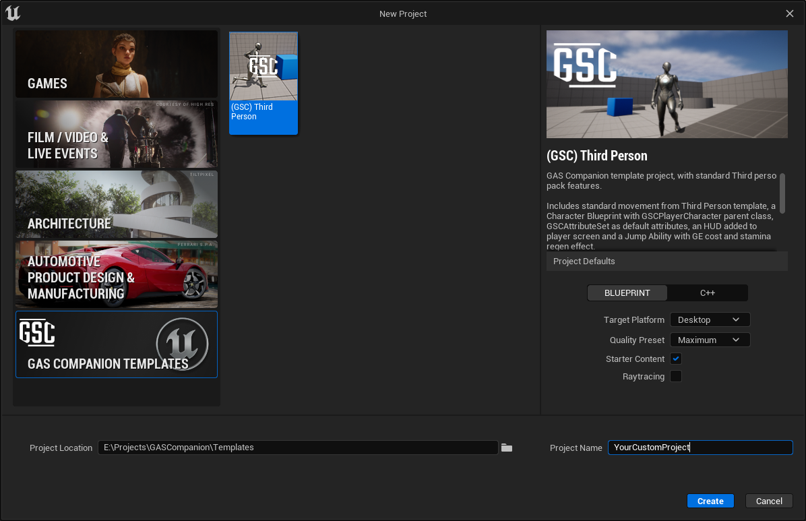

*[on June 25th, 2023](https://github.com/GASCompanion/GASCompanion-Plugin/pull/77)*

## Add ThirdPerson project templates (BP/CPP)

GAS Companion template projects, with standard Third person pack features.

Includes standard movement from Third Person template, a Character Blueprint with GSCModularCharacter parent class, GSCAttributeSet as default attributes, an HUD added to player screen, a Jump Ability with GE cost and stamina regen effect and Anim Blueprints with Gameplay Tag property mapping.

The cpp template is pretty much the same as the BP template, but with a single minimal ACharacter class as a direct child class of `AGSCModularCharacter`.

Note: Created in engine 5.0.3, and should be forward compatible in 5.1 / 5.2.

## Plugins

GAS Companion enabled by default:

```json TP_ThirdPersonBP.uproject
	"Plugins": [
		{
			"Name": "GASCompanion",
			"Enabled": true,
			"MarketplaceURL": "com.epicgames.launcher://ue/marketplace/product/d83c6f34c3fb4b7092dde195c37c7413"
		}
  ]
```

## Config

Also includes the following settings custom to this template:

```ini Config/DefaultEditorPerProjectUserSettings.ini
[/Script/UnrealEd.EditorStyleSettings]
AssetEditorOpenLocation=MainWindow

[/Script/UnrealEd.EditorLoadingSavingSettings]
LoadLevelAtStartup=LastOpened
bForceCompilationAtStartup=True

[/Script/BlueprintGraph.BlueprintEditorSettings]
SaveOnCompile=SoC_SuccessOnly
```

```ini Config/DefaultInput.ini
[/Script/Engine.InputSettings]
+ConsoleKeys=²
```

## Usage

From within the editor, click on `File > Project > New Project` then select the category `GAS Companion Templates`.



## List of templates

*   TP\_ThirdPersonBP - GAS Companion template project, with standard Third person pack features.
*   TP\_ThirdPerson - GAS Companion template for a C++ project, with standard Third person pack features. Includes a single minimal ACharacter class as a direct child class of AGSCModularCharacter.
*   ... more to do!

