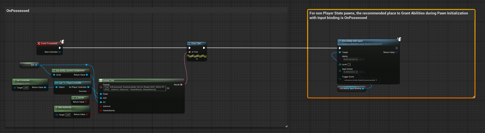
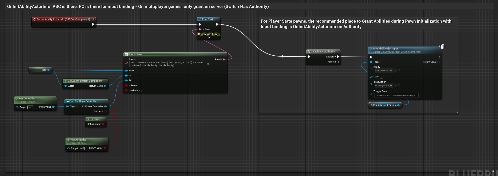
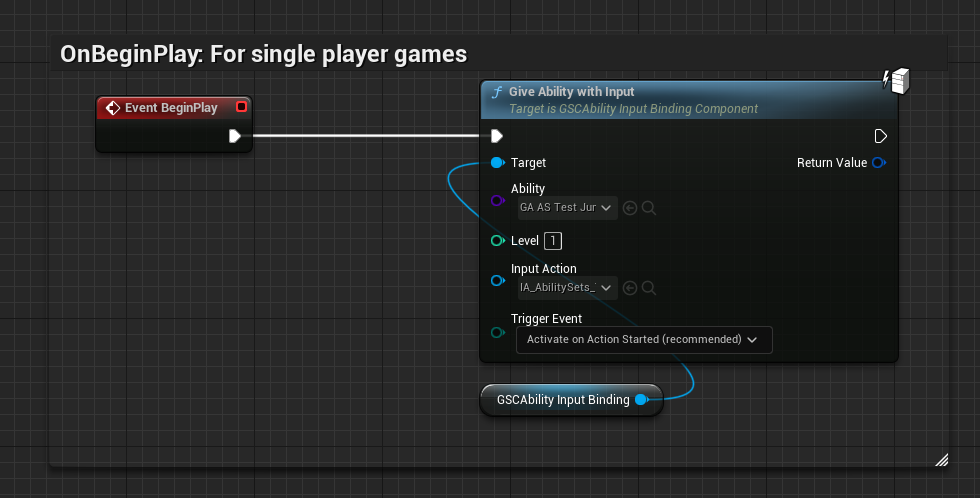

*[on June 25th, 2023](https://github.com/GASCompanion/GASCompanion-Plugin/pull/78)*

## Add GiveAbilityWithInput() method to GSCAbilityInputBindingComponent / Add GetCompanionAbilitySystemComponent() to the Blueprint library

Also added GetCompanionAbilitySystemComponent() to the Blueprint library.

***

**newly added method `UGSCAbilityInputBindingComponent::GiveAbilityWithInput()` Blueprint callable**

Grants a given Gameplay Ability to the Owner ASC, with an optional Input Action / Trigger Event to setup the ability binding.

Simply calls ASC->GiveAbility() (on Server) and binds the input on client.

This method is meant to run on Authority (must be called from server).

During Pawn initialization, if you'd like to grant a list of abilities manually with this method, the typical place to do so is:

*   For non Player State pawns: On Pawn OnPossessed event
*   For Player State pawns: OnInitAbilityActorInfo on Authority

Doing so, you ensure both ASC and InputComponent are available to both grant the ability, and setup the ability input binding.

#### Examples

**For non Player State ASC (ASC on Pawn)**

**For Player State ASC (ASC on PlayerState)**

**For Single Player Games - ASC on Pawn or PlayerState**

You can get away by simply granting abilities and input binding on begin play.

