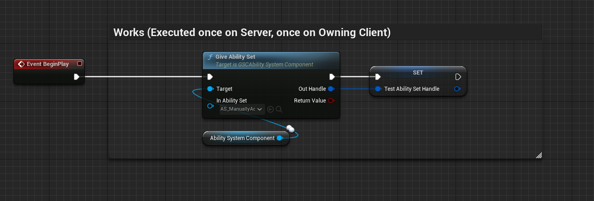
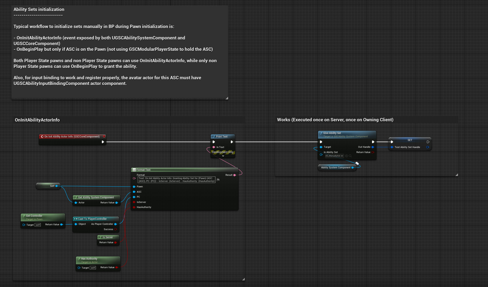
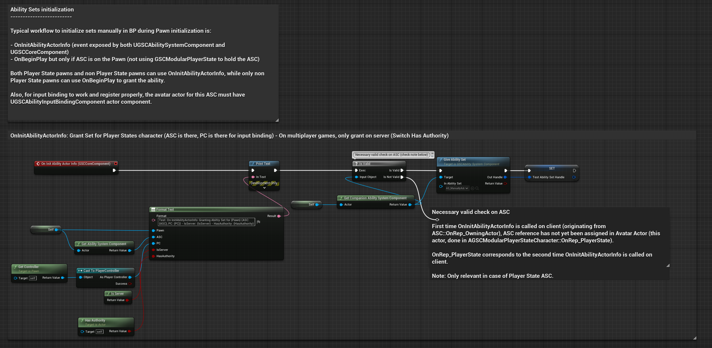
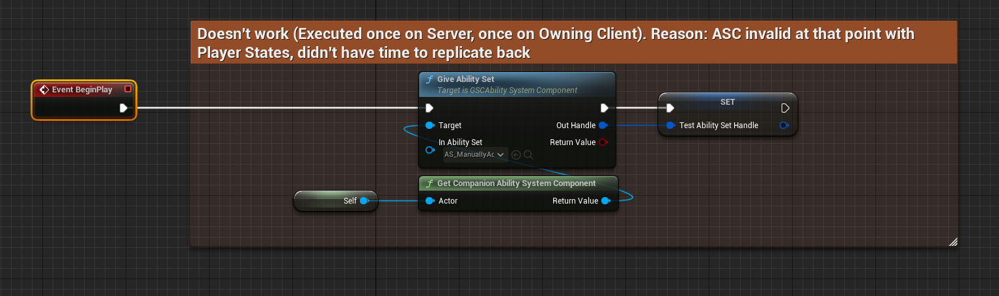
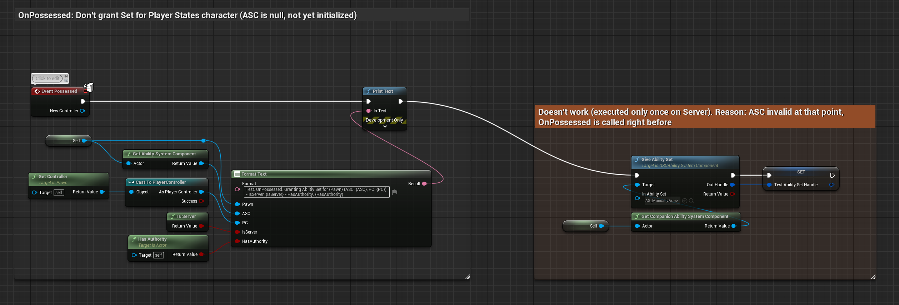
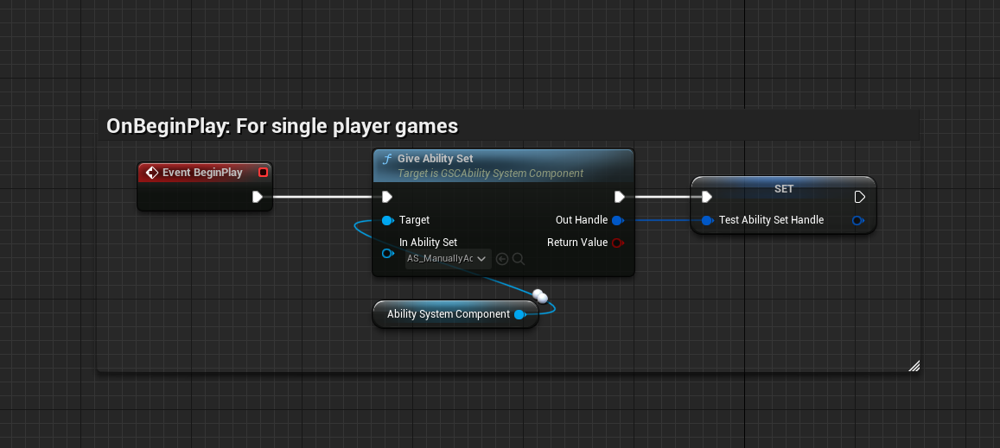

*[on June 27th, 2023](https://github.com/GASCompanion/GASCompanion-Plugin/pull/79)*

## Tweaks to Ability Sets BP exposed API

*   Moved Ability Set granting / clearing out of the Blueprint library to the ASC instead.
*   Ensured core component delegate registering for Attributes added or remove by an Ability Set is properly handled and behaves the same as Attributes added from ASC class defaults Granted Attributes (eg. BP event called on both Server / Client, cleared on Ability Set removal etc.)
*   Last pass of QA to ensure Ability Sets manually added with the Blueprint Callable are working properly, with input binding functional in both Standalone and Client.

Pawns (both PS and non PS) used in functional tests have BP snippets and comments to help in writing the documentation.

***

**newly added method `UGSCAbilitySystemComponent::GiveAbilitySet()` Blueprint callable**

Grants a given Ability Set to the ASC, adding defined Abilities, Attributes, Effects and Owned Tags.

This method is meant to run on both Authority (must be called from server), and on Client if you'd like to setup binding as well (Important to call on client too for Owned Tags)

During Pawn initialization, if you'd like to grant a list of Ability Sets manually with this method, the typical place to do so is:

*   OnInitAbilityActorInfo (event exposed by both UGSCAbilitySystemComponent and UGSCCoreComponent)
*   OnBeginPlay but only if ASC is on the Pawn (not using GSCModularPlayerState to hold the ASC)

Both Player State pawns and non Player State pawns can use OnInitAbilityActorInfo, while only non Player State pawns can use OnBeginPlay to grant the ability.

Also, for input binding to work and register properly, the avatar actor for this ASC must have UGSCAbilityInputBindingComponent actor component.

**newly added method `UGSCAbilitySystemComponent::ClearAbilitySet()` Blueprint callable**

Removes the AbilitySet represented by InAbilitySetHandle from the passed in ASC. Clears out any previously granted Abilities, Attributes, Effects and Owned Tags from the set.

Like granting, it is advised to call this method on both Server and Client for multiplayer games.

## Examples

**For non Player State ASC (ASC on Pawn)**

**For Player State ASC (ASC on PlayerState)**

For Player States ASC, trying to grant on BeginPlay or Possessed won't work on Clients (mostly Input binding will fail)

**For Single Player Games - ASC on Pawn or PlayerState**

## Related

Related Pull Requests

*   [#62](/changelog/pull/62)
*   [#73](/changelog/pull/73)

