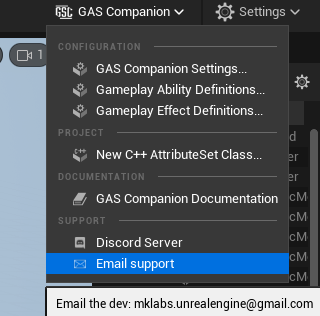
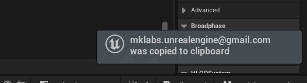

*[on December 5th, 2024](https://github.com/GASCompanion/GASCompanion-Plugin/pull/95)*

## Editor: Email support entry in GAS Companion combo menu now copies to clipboard the email address \"mklabs.unrealengine@gmail.com\" instead of trying to launch URL with mailto:mklabs.unrealengine@gmail.com

Clicking upon the entry

will now copy to clipboard the email address "<mklabs.unrealengine@gmail.com>", and display a slate notification

instead of trying to launch URL with mailto:<mklabs.unrealengine@gmail.com>.

