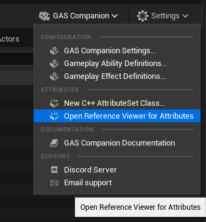
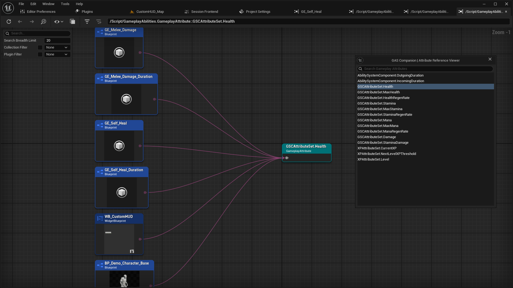

*[on December 8th, 2024](https://github.com/GASCompanion/GASCompanion-Plugin/pull/97)*

## Added Attribute ReferenceViewer and new entry in GAS Companion combo menu

This PR adds a new entry in GAS Companion combo menu in level editor toolbar: `Open Reference Viewer for Attributes`

Upon clicking, a new window opens listing all Gameplay Attributes. Clicking upon an attribute entry will open the reference viewer for that attribute, listing all assets (Gameplay Effects, Actors, etc.) using them.

<https://github.com/user-attachments/assets/effbe644-8f67-4e7e-a94c-a150019f1701>

