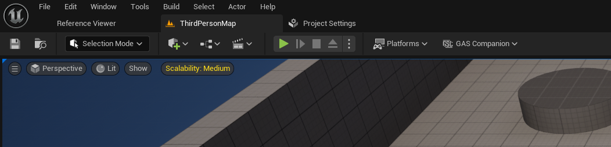
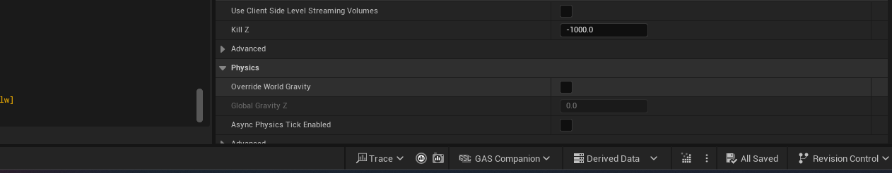
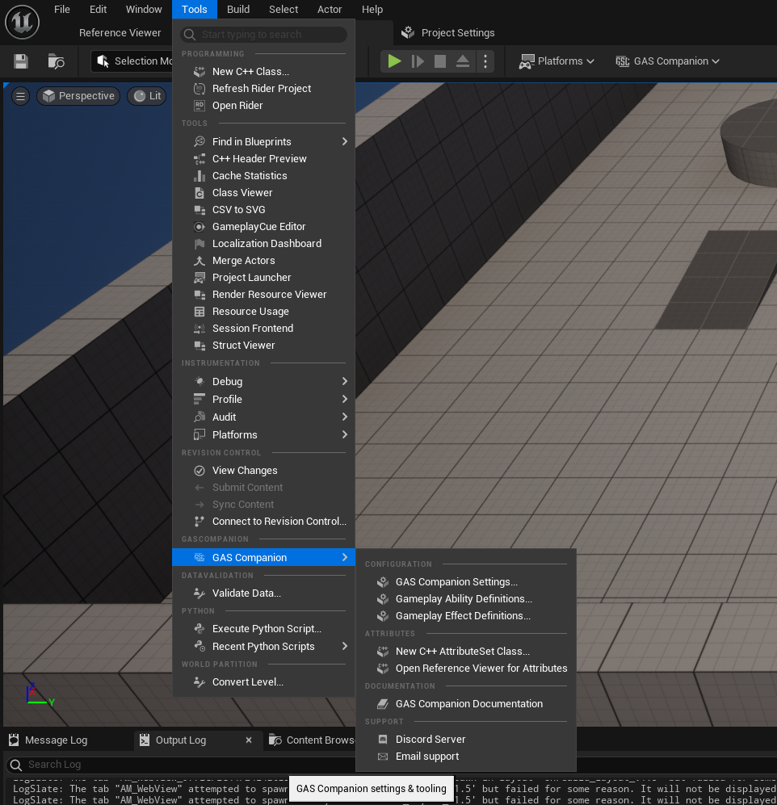
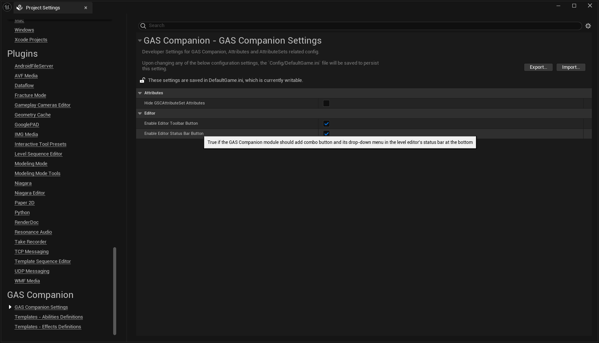

*[on June 11th, 2025](https://github.com/GASCompanion/GASCompanion-Plugin/pull/99)*

## Configurable combo menu location in level editor toolbar and status bar

And fixing 5.6 specifically that was missing proper toolbar registration, after toolbar layout rework that happened in 5.6.

A developer setting for both location has been added that when set to false will prevent GAS Companion module from adding the combo button in toolbar and / or status bar.

A new entry has also been added (no config option, always available) in the File Menu "Tools" right after "Revision Control" section.

***

in the toolbar:

status bar:

and tools menu:

with ability to control whether toolbar / status bar button should be enabled (submenu in tools file menu always enabled though):

