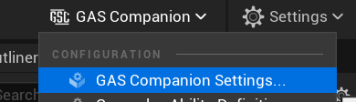
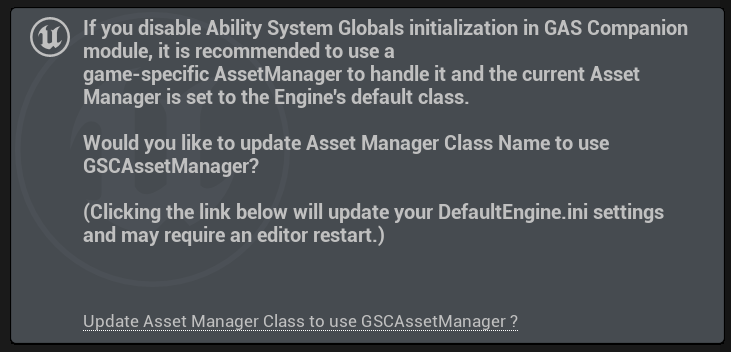
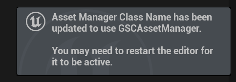

Plugin configuration described in this page is saved and loaded from your **Config/DefaultGame.ini** file.

{{ collections.all | eleventyNavigation("Core/Settings") |  eleventyNavigationToMarkdown({ showExcerpt: true }) | safe }}

You can access exposed configuration for the plugin in `Project Settings > Game > GAS Companion`.

Alternately, you can use the dropdown in the top right corner of the level editor.

### Ability System Globals (optional)

Initialization of Ability System Globals for GAS is important and usually done in an Asset Manager subclass.

GAS Companion does it by default in a PostEngineInit delegate (after engine is fully initialized) as a failsafe mechanism. And only do so if Ability System Globals wasn't initialized previously in the engine lifecycle.

There is one configuration property that lets you customize this. If you turn on `bPreventGlobalDataInitialization` (Default is false), the editor will display the following notification, with a clickable link

*Notification will only be displayed if current configuration for the Asset Manager Class Name is the engine's default.*

Upon clicking the link, Asset Manager Class Name configuration property will be updated to use `GSCAssetManager`. This class is a direct child of `AssetManager` with a single override `StartInitialLoading()`, whose role is to call `InitGlobalData()` on Ability System Globals for GAS.

This effectively result in the same behavior. In both case, `InitGlobalData()` is ensured to be called once, either from within an `AssetManager` or a little later in GAS Companion runtime module (when engine is initialized).
