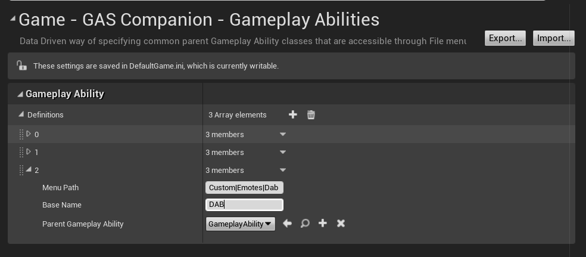
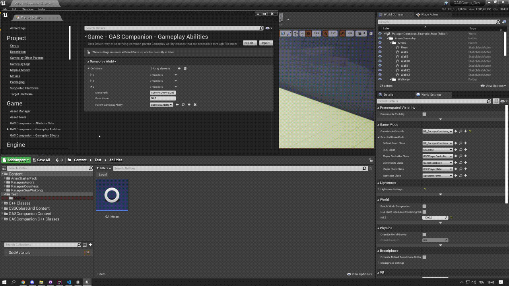

## Gameplay Ability Definitions

The configuration section "GAS Companion - Gameplay Abilities" provides a data driven way of specifying common parent Gameplay Ability classes that are accessible through File menu. By default, only the Melee ability coming with the plugin is defined: [Melee Ability]({{ "/melee-ability" | url }})

You can even create your own definition, this results in a quick way to create new abilities based on the appropriate class from the context menu 

## Create your own Definitions

The best part is that this system allows you to add your own Gameplay Ability Definitions. Or even edit / remove the default ones.

| Property                  | Description       |
| ------------------------- |-------------------|
| Menu Path                 | Where to show this in the menu. Use "" for sub categories. E.g, "Ability|Skills|Ultimate". |
| Base Name                 | The default BaseName of the new asset. E.g "Damage" -> GA_Damage                            |
| Parent Gameplay Ability   | The Parent GameplayAbility class to use when creating new abilities for this definition     |

The above example definition will add a new category to the context menu, like so:

