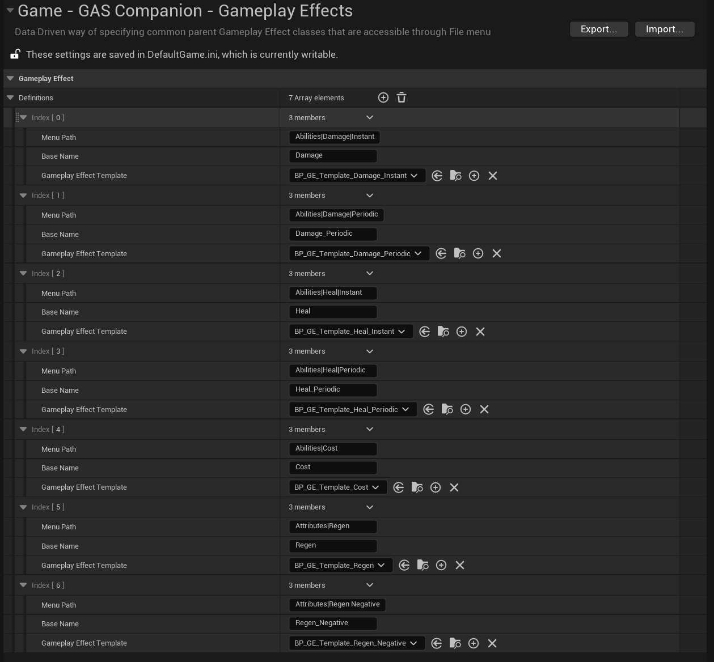
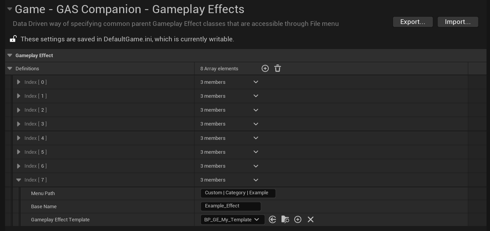
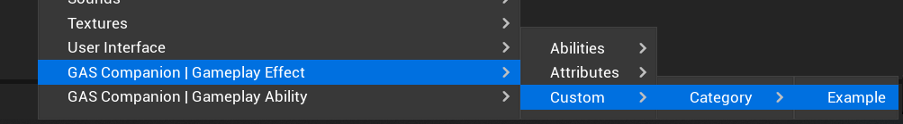
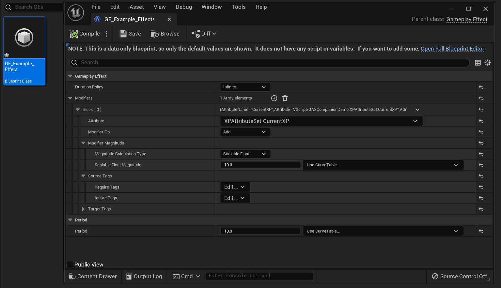

## Gameplay Effect Definitions

Similar to the [Gameplay Ability Definitions]({{ "/config/ga-definitions/" | url }}), you can do the same with Gameplay Effects.

Here is the default one included in GAS Companion.

Remember that you can create your own definitions, edit the default ones or even remove them if you'd like. This configuration is stored in `DefaultGame.ini`.

## Create your own Definitions

You can create your own template for Gameplay Effect and make them available via the context menu.

To do so, you need to create a Blueprint child of {{ "GSCTemplate_GameplayEffectDefinition" | api }}, and modify the template as you wish. Any new Gameplay Effect created from Context Menu using this template as a base will be created using the template properties.

Create Gameplay Effect will be a direct child of `UGameplayEffect`.

| Property                  | Description       |
| ------------------------- |-------------------|
| Menu Path                 | Where to show this in the menu. Use "\|" for sub categories. E.g, "Custom\| Category\| Example". |
| Base Name                 | The default BaseName of the new asset. E.g "Example_Effect" -> GE_Example_Effect                          |
| Gameplay Effect Template   | The Parent template (child of {{ "GSCTemplate_GameplayEffectDefinition" | api }}) class to use when creating new Gameplay Effect for this definition     |

The above example definition will add a new category to the context menu, like so:

Upon clicking the last part of the context menu tree (here "Example"), a new GE Blueprint is created named after the `Base Name` option in config.

*Gameplay Effect with only Modified properties displayed, based on the values defined in `BP_GE_My_Template`.*
