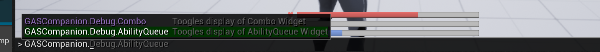
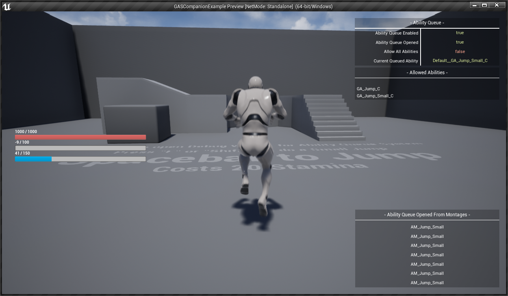

GAS Companion provides a few Console Commands to help in debugging you can access via the built-in debug console. This is done via an Engine Subsystem that registers custom commands to the Console Manager.

## GAS Companion Commands

### GASCompanion.Debug.AbilityQueue

This command shows / hides the [Ability Queue Debug Widget](/ability-queue-system#debug-widget)

Here is a brief description of the debug widget:

- `Ability Queue Enabled` whether the ability queue is enabled for the player character
- `Ability Queue Opened` whether the ability queue is currently opened via the ability or anim montages. Abilities can be queued only within this window.
- `Allow All Abilities` the queue system requires a list of abilities to be allowed for activation. This boolean can be turned on in abilities or within anim montages (via notify state) state which will consider *all* abilities for activation.
- `Current Queued Ability` is updated when an ability attempts to activate within the ability queue opened window and fail to do so, setting it up for activation when the current ability ends.
- `Ability Queue Opened From Montages` at the bottom right displays a list of anim montages from which the ability queue was opened via notify state (`AbilityQueueWindow`)

When using this command, make sure your Character Blueprint has the corresponding component available. If not the command will fail and warn you about the missing component.

### GASCompanion.Debug.Combo

This command shows / hides the [Combo Debug Widget](/melee-ability/#debug-combo-widget)

Here is a brief description of the debug widget:

- `Combo Window Opened` whether the combo window is currently enabled for the player character (done with anim montages notifiers)
- `Should Trigger Combo` indicates the player has queued an input for activation of the next combo montage
- `Request Trigger Combo` turned on by the Trigger Combo notifier, the exact time within the Combo Window to activate the next combo montage if the player registered an input within the combo window
- `Next Combo Activate` is updated when the following combo montage has been activated, used when closing the combo window to know if combo needs to be reset
- `Combo Index` the current combo index, ranging from 0 to the size of the Montages list in the Combo Ability

When using this command, make sure your Character Blueprint has the corresponding component available. If not the command will fail and warn you about the missing component.

## GAS Gameplay Debugger

Alongside GAS Companion custom commands, the engine's gameplay debugger for GAS is an invaluable resource to help debugging your Attributes, Abilities and Effects.

See [GASDocumentation Debugging section](https://github.com/tranek/GASDocumentation#debugging) for more information about the two below commands.

- `showdebug abilitysystem` - Opens / Close GAS Gameplay debugger.
- `AbilitySystem.Debug.NextCategory` - Navigate to the the next page for the gameplay debugger. First one is the Attributes, second one is for Gameplay Effects, third and final one is for Gameplay Abilities.
- `AbilitySystem.Debug.NextTarget` / `AbilitySystem.Debug.PrevTarget` These two commands allow you to cycle through all the ability system component available in the world and switch the debug target.