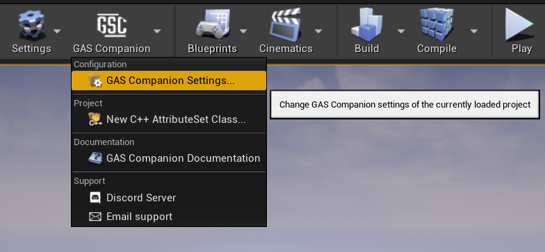
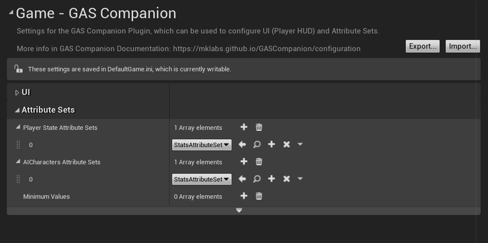
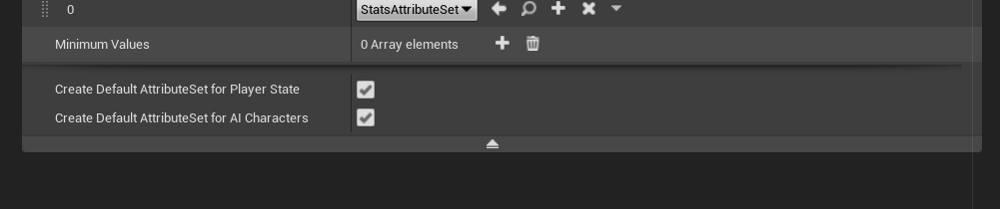

Once you have the plugin installed and enabled, you can start configuring it. You can disable / enable the plugin in `Edit > Plugins > Gameplay > GASCompanion`.

Plugin configuration described in this page is saved and loaded from your **Config/DefaultGame.ini** file. To access those settings, you can open your Project's settings or use the Toolbar Dropdown menu:

## UI Configuration

You can change the default HUD User Widget used by the Player Controller.

GAS Companion provides three basic HUD Widget Blueprint for demonstration purpose:

- `WB_HUD` Default Widget as seen in the above picture
- `WH_HUD_TopLeft` Same Widget but with a slight variation in the positioning of the attributes progress bar
- `WB_HUD_Minimalist` Another HUD variation, this time with a minimalist feel

If you want to create a custom Widget for your HUD, you can refer to the [UI Documentation page](/working-with-ui).

## AttributeSet Configuration

***Only for 4.26 users***

You can configure here any custom AttributeSet you want to be created and attached to your Player and AI / NPC Characters. It is a required step to be able to use any Attributes you generated with the [Attributes Wizard](/gameplay-attributes).

### *Advanced configuration*

You can click the little down arrow at the end of the `Attribute Sets` category to access some advanced settings.

You can control whether or not to create and attach default GAS Companion AttributeSet (UGSCAttributeSet with Health, Stamina, Mana, ...) in PlayerStates and / or AI Characters.
	
You probably want to keep it true, unless you handle those attributes yourself (in HUD, Abilities, Effects, ...)

## Attributes Minimum Values

You can configure configure the minimum values of attributes when clamping is done by the provided AttributeSet's [PostGameplayEffectExecute](https://github.com/tranek/GASDocumentation#concepts-as-postgameplayeffectexecute).

This is an optional step, as the default value for minimum values are `0`, which is the common expected behavior.

This is however useful to specify when using abilities with `bIgnoreAbilityCost` set to true, which allow activation of abilities even if the applied cost would go into negative values, and only prevented if the attribute is 0 or below.

**Example:** *If you have a regeneration effect on an attribute, it would then take longer for the attribute to go positive again.*

More information about [Ignore Ability Cost for Abilities](/ignore-ability-cost) in the corresponding page.

To configure in Unreal Editor, go to `Edit > Project Settings > Game > GASCompanion`.

