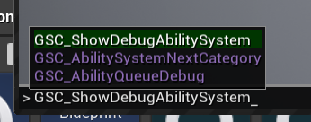

The `1.2.1` version of GAS Companion introduces an Editor Module, which adds a new dropdown menu in the Level Editor Toolbar.


From there, you can get quick access to the [Plugin Configuration in Project Settings](/configuration), View online documentation, [Join our Discord Server](https://discord.gg/d4rs4vcX6t) or [Send an email for support](mailto:daniel.mickael@gmail.com?subject=GASCompanion).

More importantly is the addition of a custom AttributeSet C++ Class creation wizard. Click the `New C++ AttributeSet Class...` button from the dropdown menu.

**Note** *1.2.1 is only available for 4.26 users as it relies on the new ClassTemplateEditorSubsystem feature of Unreal. There is currently an [opened issue](https://github.com/mklabs/GASCompanion/issues/5) to try to backport this system to earlier versions.*

## Add AttributeSet C++ Class Wizard

With GAS, one of the only thing that requires C++ no matter what is the creation of AttributeSet and Gameplay Attributes. This is the main blocking point for non c++ programmers willing to use GAS in their project.

This AttributeSet C++ Class generation feature aims to alleviate that.


It works the same way as the standard Editor `New C++ Class...` action from File Menu or Content Browser, except it is customized to generate a valid AttributeSet with the Gameplay Attributes you can configure through the Class creation dialog.

Here is a quick demonstration of the creation of a new AttributeSet:

https://youtu.be/heaTnGvBZHA

### Configure Class name and path

Define here the name for your new AttributeSet class, and its location. You can choose in which C++ module you want it to be generated (eg. all the local C++ module for your game and plugins, when in doubt use the default value which is your main game module).


The wizard will warn you if the name / path are invalid, or if the Class name is already used.

### Configure the Gameplay Attributes to generate

Next, you need to define at least one Attribute for your new AttributeSet.

Click the `+` icon next to the `Attributes` property, and configure here the Attribute Name, its default value and Category specifier.


Attributes must have a valid name (cannot contain space, must begin with alphabetic character, etc.) and cannot contain duplicates (several attributes with same name).

You can define a default value for the Attribute, before it gets initialized or modified by a Gameplay Effect.

Lastly, the Category specifier is optional. It is the standard Category property specifier defined with UProperties (`Category="TopCategory|SubCategory|..."`).

> Specifies the category of the property when displayed in Blueprint editing tools. Define nested categories using the | operator.
> ~ [Property Specifiers](https://docs.unrealengine.com/en-US/ProgrammingAndScripting/GameplayArchitecture/Properties/Specifiers/index.html)

Gameplay Attributes are replicated by default, and will work for both Single Player and Multiplayer scenarios.

### Generate!

When you're ready to start the generation process, click the `Create Class` button. If it is disabled, it means that there are some validation errors you need to fix beforehand.


The engine will start adding code to your project


And try to compile the project


If the compilation goes fine, the engine will hot reload your project and you'll be able to use your new Attributes right away.

If there is a compilation error, this is most likely due to the fact you already have a c++ project, and don't have `GASCompanion`  module in your `Build.cs` file. The generated AttributeSet inherits from `GSCAttributeSetBase` which requires you adding `GASCompanion` module dependency to your game module. Once done, re-compile.

**Note** *For non code project (eg. pure Blueprint), the Wizard will create basic source code module for your project and handle the generation of a valid `Build.cs` file for you.*

The Editor will open the newly added class header / source files in your IDE, which you might inspect or edit as you see fit.

Here's the header and source file generated from the examples described above.

```cpp title=Public/StatsAttributeSet.h
#pragma once

#include "CoreMinimal.h"
#include "Abilities/Attributes/GSCAttributeSetBase.h"
#include "AbilitySystemComponent.h"
#include "StatsAttributeSet.generated.h"

UCLASS()
class GASCOMPANIONEXAMPLE_API UStatsAttributeSet : public UGSCAttributeSetBase
{
	GENERATED_BODY()

public:

	// Sets default values for this AttributeSet attributes
	UStatsAttributeSet();

    // AttributeSet Overrides
    virtual void PreAttributeChange(const FGameplayAttribute& Attribute, float& NewValue) override;
    virtual void PostGameplayEffectExecute(const FGameplayEffectModCallbackData& Data) override;
    virtual void GetLifetimeReplicatedProps(TArray<FLifetimeProperty>& OutLifetimeProps) const override;
        
    UPROPERTY(BlueprintReadOnly, Category = "Character|Stats", ReplicatedUsing = OnRep_Vitality)
    FGameplayAttributeData Vitality = 0.0;
    ATTRIBUTE_ACCESSORS(UStatsAttributeSet, Vitality)    

protected:
    
    UFUNCTION()
    virtual void OnRep_Vitality(const FGameplayAttributeData& OldVitality);
};
```

```cpp title=Private/StatsAttributeSet.cpp
#include "StatsAttributeSet.h"
#include "Characters/GSCCharacterBase.h"
#include "GameplayEffectExtension.h"
#include "Net/UnrealNetwork.h"

// Sets default values
UStatsAttributeSet::UStatsAttributeSet()
{
	// Set default values for this Set Attributes here
}

void UStatsAttributeSet::PreAttributeChange(const FGameplayAttribute& Attribute, float& NewValue)
{
    // This is called whenever attributes change, so for max attributes we want to scale the current totals to match
    Super::PreAttributeChange(Attribute, NewValue);

    // Set adjust code here
    //
    // Example:
    //
    // If a Max value changes, adjust current to keep Current % of Current to Max
    //
    // if (Attribute == GetMaxHealthAttribute())
    // {
    //     AdjustAttributeForMaxChange(Health, MaxHealth, NewValue, GetHealthAttribute());
    // }
}

void UStatsAttributeSet::PostGameplayEffectExecute(const FGameplayEffectModCallbackData& Data)
{
    Super::PostGameplayEffectExecute(Data);

    AGSCCharacterBase* SourceCharacter = nullptr;
    AGSCCharacterBase* TargetCharacter = nullptr;
    GetCharactersFromContext(Data, SourceCharacter, TargetCharacter);

    const FGameplayTagContainer SourceTags = GetSourceTagsFromContext(Data);
    const FGameplayEffectContextHandle Context = Data.EffectSpec.GetContext();

    // Get Minimum Clamp value for this attribute, if it is available
    const float ClampMinimumValue = GetClampMinimumValueFor(Data.EvaluatedData.Attribute);

    // Compute the delta between old and new, if it is available
    float DeltaValue = 0;
    if (Data.EvaluatedData.ModifierOp == EGameplayModOp::Type::Additive)
    {
        // If this was additive, store the raw delta value to be passed along later
        DeltaValue = Data.EvaluatedData.Magnitude;
    }

    // Set clamping or handling or "meta" attributes here (like damages)

    // if (Data.EvaluatedData.Attribute == GetHealthAttribute())
    // {
    //     // Handle other health changes. Health loss should go through Damage meta attribute
    //     SetHealth(FMath::Clamp(GetHealth(), ClampMinimumValue, GetMaxHealth()));
    //
    //     if (TargetCharacter)
    //     {
    //         TargetCharacter->HandleAttributeChange(GetHealthAttribute(), DeltaValue, SourceTags);
    //         TargetCharacter->HandleHealthChange(DeltaValue, SourceTags);
    //     }
    // }
}

void UStatsAttributeSet::GetLifetimeReplicatedProps(TArray<FLifetimeProperty>& OutLifetimeProps) const
{
    Super::GetLifetimeReplicatedProps(OutLifetimeProps);
        
    DOREPLIFETIME_CONDITION_NOTIFY(UStatsAttributeSet, Vitality, COND_None, REPNOTIFY_Always);
}

void UStatsAttributeSet::OnRep_Vitality(const FGameplayAttributeData& OldVitality)
{
    GAMEPLAYATTRIBUTE_REPNOTIFY(UStatsAttributeSet, Vitality, OldVitality);
}
```

## Test the newly added Attributes

To quickly test the Attributes you generated, create or edit an existing Gameplay Effect and check if you see them in the modifiers list.


Now, to properly use this new AttributeSet, you need to attach it to your Characters, which is usually done only through C++.

That being said, GAS Companion `1.2.1` introduces the ability to configure which AttributeSet to attach to your Characters via Project's Settings, which you can learn more in the next section.

### AttributeSet Configuration

To quickly get to the plugin Settings, you can use the toolbar dropdown menu and click on `GAS Companion Settings`:


Both the Player State (for Player or "Hero" Characters) and AICharacter base Class of GASCompanion can dynamically create and attach any number of AttributeSets configured here, in addition to the "default" AttributeSet (the one holding Health, Stamina, Mana, ... Attributes).

Configure here your newly added AttributeSet to the Character types you want them to be attached to.

Once done, you can start the game in PIE and launch the `GSC_ShowDebugAbilitySystem` command (or `showdebug abilitysystem`). Type `²` within the game to open the command prompt.



You'll be able to see the Gameplay Ability System debugger, and check if your newly added Attribute is there:


Also with `1.2.1` version comes the ability to react to Attributes change from your Characters Blueprint with OnPostGameplayEffectExecute and OnPreAttributeChange events, used to perform Attributes change management usually done only via C++, which you can learn more about on the [next page](/attributeset-events).