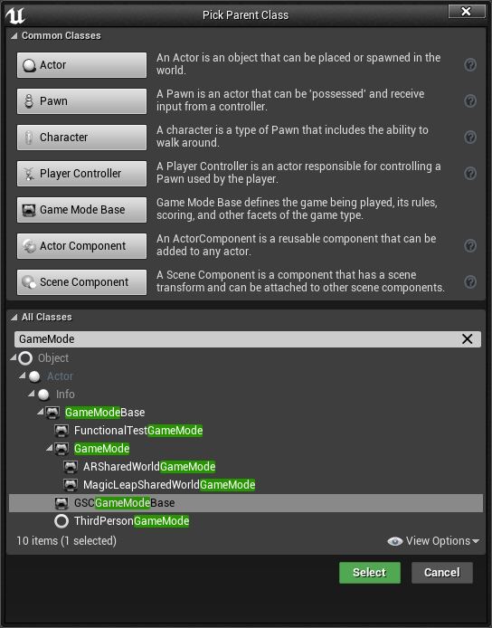
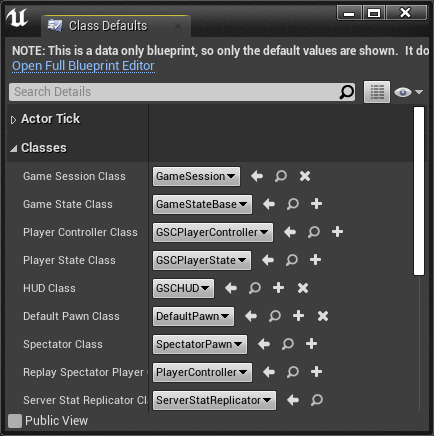
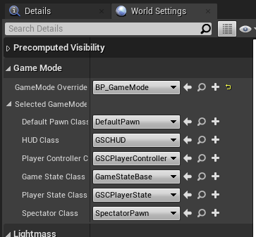
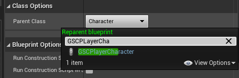
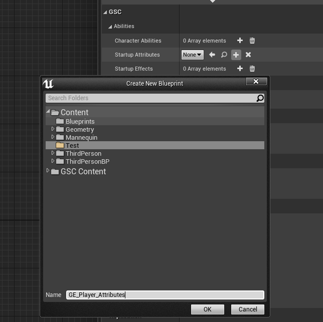
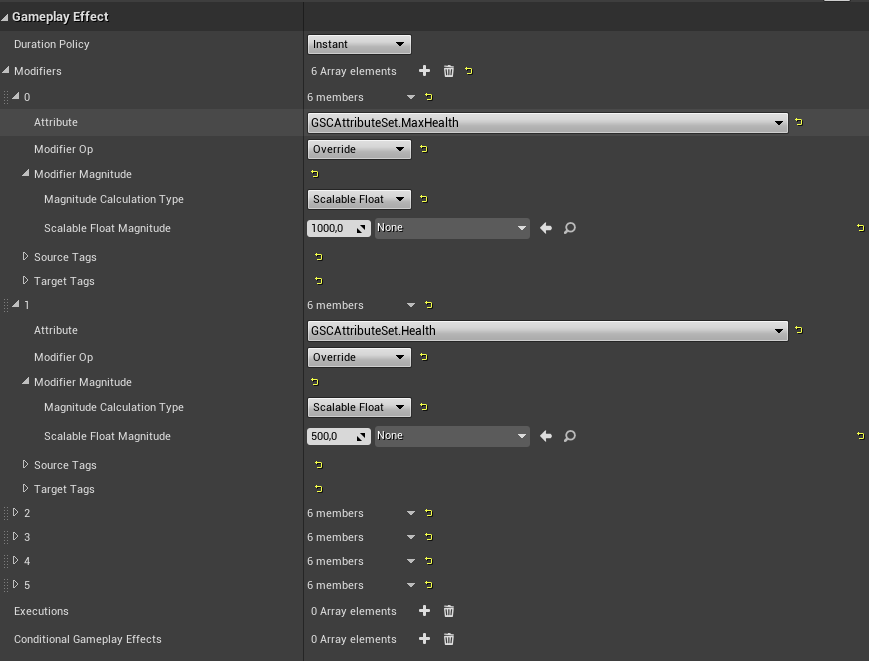
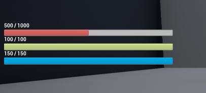
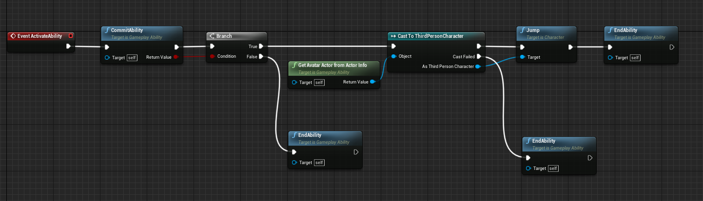
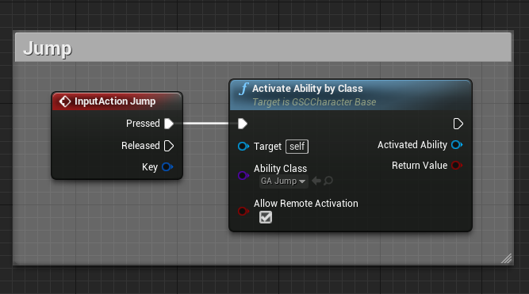

Once the plugin is installed and configured, it's time to start creating our gameplay.

## Setup GameMode

The first thing we need to do is a create a GameMode inheriting from `GSCGameModeBase`.

Right Click anywhere in the Content Browser and Create a new Blueprint Class. In the Pick Parent Class Window, make sure to select `GSCGameModeBase`

We're going to call this Blueprint `BP_GameMode`. GameModes are important classes that allow you to configure which class to use in your Maps, for various part of the Gameplay Framework such as:

- Player Controller
- Player State
- HUD Class
- Default Pawn
- etc.

The classes mentioned above are the one we need to configure. `GSCGameModeBase` comes pre-configured with most of them, but you can decide to create a BP deriving from the corresponding class for each of these and set it up accordingly in your GameMode, if you need customization.

Now, we need to configure our Map to use this `BP_GameMode`. To do so, go into your World Settings Panel (if you don't see it, open it with `Window > World Settings`) and select your GameMode in `GameMode Override`.

## Setup Pawn Class (Player Character)

In this example, we're going to use Epic's Third Person Blueprint Template.

If you haven't started your project using this template, add it now with `Add / Import > Blueprint Feature > Third Person` from the Content Browser.

Open `ThirdPersonCharacter` Blueprint (by default located in `Content/ThirdPersonBP`) and reparent it to use `GSCPlayerCharacter` as a Base Class.

To do so, click on `Class Settings` and pick `GSCPlayerCharacter` in the Parent Class dropdown.

`GSCPlayerCharacter` inherits from `GSCCharacterBase` which itself inherits from `ACharacter` (which was the previous Base Class for `ThirdPersonCharacter` Blueprint)

Now, we need to update our `BP_GameMode`. Select `ThirdPersonCharacter` in the Default Pawn Class dropdown. Also, delete the default Character from the scene. It is setup to Auto Possess Player and will prevent your Default Pawn Class from being spawned at the PlayerStart location.

We can now hit "Begin Play" and see something like this:

The HUD is displayed which indicates everything is working correctly 

***Note:*** *You can change the HUD Widget Blueprint by creating your own HUD Blueprint (child of `GSCHUD`) and changing its `HUDWidgetClass` property. Also don't forget to update your GameMode to use your new HUD.*

However, all attributes are initially set to 0. We can fix that with the Character `StartupAttributes` property.

### Character Startup Attributes

`StartupAttributes` is essentially a GameplayEffect that is applied when the character spawns, giving you the chance to initialize its attributes and stats.

We can quickly create a new GameplayEffect from the Character's details panel, in the `GSC | Abilities` category.

Click the `+` icon next to `Startup Attributes`, then select a folder and a name for your new Gameplay Effect. Here, we'll create a new `GE_Player_Attributes` blueprint.

The editor should open this blueprint for you. Since it is a "data-only, you can close and re-open it to have only the defaults value shown.

This is where you can specify your Character default attributes via Modifiers.

- Duration Policy should be set to Instant.
- Create 2 Modifiers for each attribute you want to initialize
    - One for the Max Value, one for the actual Value.
    - Modifiers Modifier Op should be set to Override.

Here is the result:

We can now move on designing our first abilities and effects.

### Character Abilities

To activate abilities for a given Character, they must be "granted" before being used.

The `CharacterAbilities` property lets you specify a list of Gameplay Ability to give to the Character on spawn.

Similarly, the `GrantAbility` function can be used to do the same thing from Blueprints.

### Startup Effects

The `StartupEffects` property behaves the same and lets you specify a list of Gameplay Effects to apply to the Character on spawn.

***Note:*** *You might very well used this property to initialize your Attributes via a Gameplay Effect instead of using `StartupAttributes`. It is essentially doing the same thing.*

## First Ability

In this section, we'll implement our first ability. To keep things simple, it is going to be a Jump ability and will cost a set amount of Stamina to activate.

For now, our jump mechanism is done in `ThirdPersonCharacter` BP, which is part of the Third Person Template.

Let's create the Gameplay Ability.

Anywhere in the Content Browser, Right-Click and create a new Blueprint Class with `GSCGameplayAbility` as a parent class. 

You can also use Right-Click and choose `Gameplay > Gameplay Ability Blueprint`.

***Note:*** *You can also simply inherit from `GameplayAbility` but `GSCGameplayAbility` comes with a few additional features and is better integrated into the framework that GAS Companion provides to you.*

Name the Ability Blueprint `GA_Jump` and open it. From there, you'll see two events you can implement `ActivateAbility` and `OnEndAbility`.

We basically want to trigger the `Jump` method from our Character in the `ActivateAbility` event. To do so, wire up your Blueprint do be like:

There is two important method to invoke when designing abilities:

- `CommitAbility()` This is where and when resources are checked and applied, such as cooldowns and costs.
- `EndAbility()` Method to invoke when the `GameplayAbility` should terminate, it is important to call this method otherwise the Ability will go on forever, possibly preventing further executions (unless you have an Ability that is meant to run indefinitely, like a passive ability)

`GetAvatarActorFromActorInfo()` lets you get back a reference to the Actor that is owning the ability. Since we want to call `Jump()` on it, a `ACharacter` method, we need to cast the Actor to the appropriate class to be able to do so.

***Note:*** *If you want to call the `StopJumping()` method that was called previously, you can do that with GameplayEvents triggered from the `Released` pin and use `WaitGameplayEvent` task in your ability. But it's a bit beyond the scope of this "quick start" guide.*

We can test if our newly created Ability is working. We need to activate it somehow, we can simply use the `InputAction Jump` in `ThirdPersonCharacter` BP to do that.

If you test it now, it won't work. It's because we forgot an important step: granting the ability.

In the Details panel, add `GA_Jump` to the `CharacterAbilities` list:

Hit Play, and the Character can freely jump again. Yay!

To make things a bit more interesting, let's associate a Stamina cost to this ability.

### Stamina Cost

Costs are applied through GameplayEffects. To associate a Stamina cost with the ability, we need to create the associated GameplayEffect and provide it in the `Cost Gameplay Effect Class` property.

Like we did for the Character `StartupAttributes`, you can quickly create a new GameplayEffect with the little `+` icon next to the property:

Do that now and create the GameplayEffect. In this example, we named it `GE_Jump_Cost`.

You can them specify the attributes that are going to be used as a cost. We make sure to use an Instant Duration Policy and an Additive operation (Add for `Modifier Op`). The float value is configured to be `-40` but feel free to use whatever you want. Just make sure the value is negative otherwise you'd be adding resources on each activation (goes a bit against the notion of "Cost")

You can also decide to use other attributes, or even multiple attributes to spend on each jump.

Hit Play, each jump should now cost 40 stamina, until you have not enough resource to jump.

### Cooldown

You might want to associate a cooldown to an Ability. In this section, we'll go over very quickly how you can associate a Gameplay Effect to be used as the cooldown of our Jump Ability.

Abilities have a special `GameplayEffect` property specifically designed to be used as a cooldown.

We need to create a new `GameplayEffect` and make our ability use it as a `Cooldown GE` (you can click the "+" icon next to the property to quickly create one)

This Cooldown GE should be a `Duration` effect with no `Modifiers` and a unique `GameplayTag` per `GameplayAbility`, in the `GrantedTags` slot.

How long the cooldown will last is specified by the `Duration Magnitude`, here using a Scalable Float of 5.0 (meaning we'll be able to jump every 5 seconds).

To add new Tag for the `GrantedTags` slot, click the "Edit..." button for the "Added" row and create it from there:

Finally, make sure your ability is using this `Cooldown GE` in the `Cooldown Gameplay Effect Class` property.

For more information about Cooldown Gameplay Effect, please refer to [GASDocumentation section on this](https://github.com/tranek/GASDocumentation#4515-cooldown-gameplay-effect) as it explains the concept much better than I can do.

## Stamina Regen Gameplay Effect

Now that we have a jump ability and an associated Stamina cost, how about setting up a "passive" effect to regenerate the stamina ?

Create a new GameplayEffect, named `GE_StaminaRegen` with the following values:

- **Duraction Policy** Infinite
- **Modifier Attribute** Stamina
- **Modifier Operation** Add
- **Modifier Magnitude** 5
- **Period** 0.2 (in seconds)

***Note:*** *You can also choose to use another attribute to calculate the amount of resource to add per period with the use of `Attribute Based` Magnitude Calculation Type, which is pretty common. `GSCAttributeSet` has a RegenRate attribute for Health, Stamina and Mana that you can use.*

We now need to apply this effect to our Character. The `StartupEffects` can be used to do that. Update the property in the Character BP:

If you Hit Play now, you should see the stamina regenerate after each Jump ;)
