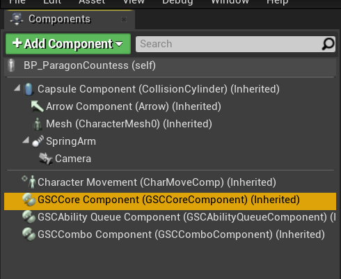

## 2.0.0 Migration Guide

`2.0.0` is a major version update because it introduces changes that are likely to bring some breaking changes from previous versions.

In this version, most of the API have been reworked to embrace a component based approach, where most of the plugin features are move to independent Actor Components. The main component you want to use to access Companion API being [`GSC Core Component`](/api/gsc-core-component). While it brings a lot more consistency and an unified way of sharing plugin features across different kind of Actors (Actors, DefaultPawns, Characters), it is also likely to require some modifications to your Blueprints / source code if you were using the previous `1.2.x` version.

### UFUNCTIONs

If you were using blueprint exposed `UFUNCTION` previously by `GSCBaseCharacter`, you now need to use [`GSC Core Component`](/api/gsc-core-component) to access those.

For most of them, you can right click within the graph and start searching for the same name, the Editor should give you access to the appropriate methods via `GSC Core Component`.

### Blueprint Events

Blueprints events you were used to have also moved to [`GSC Core Component`](/api/gsc-core-component). Unlike methods, searching for them via the Graph Context Menu won't display those events. 

They are now `BlueprintAssignable` properties on the component, meaning you'll need to select the component in the Components panel:

Once selected, you'll be able to see each exposed events in the Details panel:

Click the + icon to implement one of these events in your Blueprint Graph. And as always, each one should have a descriptive tooltip.

