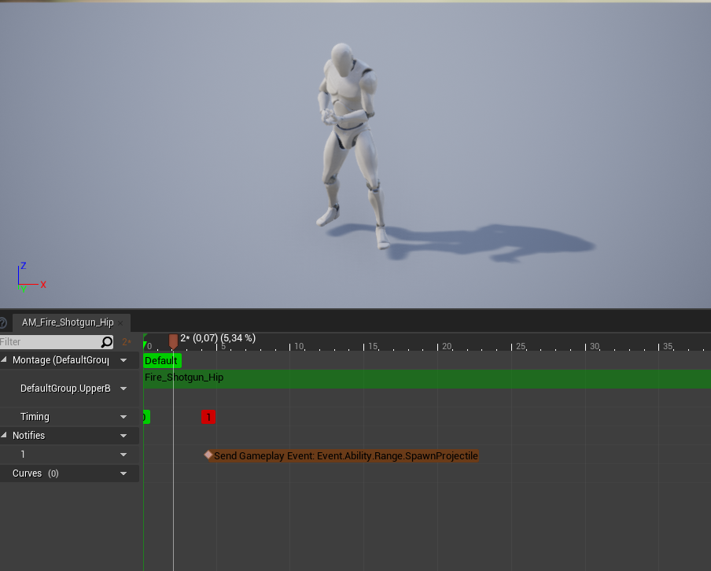
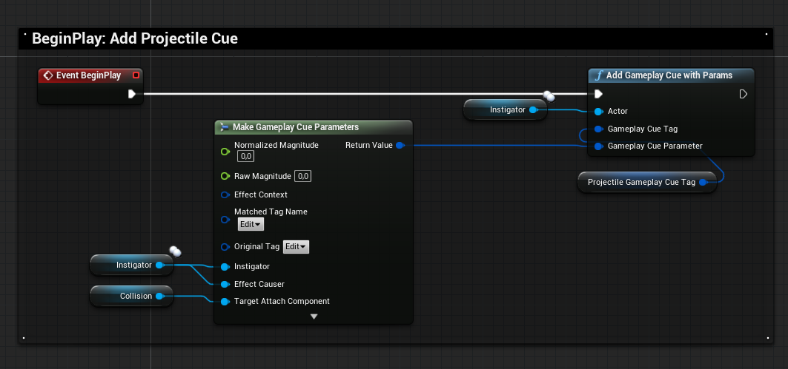

Introduced in 2.0.0 version of the plugin, `GA_GSC_Projectile_Base` is a GameplayAbility Blueprint you can subclass and quickly create projectile based abilities for your characters.

**Warning** *The projectile ability has some quirks, and should be considered beta / experimental and will be revisited in future versions.*

Creating a new projectile ability requires the following steps:

- Create child blueprint from `GA_GSC_Projectile_Base` and edit parameters
- Grant the Ability and activate it from your Character BP

**Quick Demo**


## Example Map

The LaunchPad AGR Pro Example map demonstrates its usage.

https://youtu.be/8owkiRN5THE


## Create Projectile Ability

Right click in the Content Browser, and create a new `Gameplay > Gameplay Ability Blueprint` and choose `GA_GSC_Projectile_Base` as your parent class

Alternately, you can use the custom context menu GAS Companion adds with [Gameplay Ability Definitions](/gameplay-ability-definitions).


Name it with something that suits y.

`GA_GSC_Projectile_Base` child blueprints are meant to be data only blueprint, the ActivateAbility implementation is handled by the parent class.

You can then open the blueprint to see the parameters exposed. Since it is a data only blueprint, you can close and reopen it to get the Class Defaults panel maximized.

The parameters you want to tweak are below the "Projectile Ability Parameters" category at the top.


| Parameter                                 | Description                                                                                                                                                                                                                               |
|------------------------------------------ | ----------------------------------------------------------------------------------------------------------------------------------------------------------------------------------------------------------------------------------------- |
| ProjectileClass                           | The Projectile class (or blueprint) to use for spawning projectile                                                                                                                                                                        |
| OnOverlapGameplayEffect                   | The Gameplay Effect to apply for overlapped actors                                                                                                                                                                                        |
| MontageToPlay                             | Montage to play, to use with a tag triggered from Montages with SendGameplayEventByTag Anim Notify                                                                                                                                        |
| SpawnProjectileMontageEventTag            | If using Montage, must be specified and trigger from Montages with SendGameplayEventByTag Anim Notify                                                                                                                                     |
| Range                                     | Use to determine the end point of the camera component forward vector when calculating rotation (if bUseLookAtRotation is true)                                                                                                           |
| ProjectileInitialSpeed                    | Initial speed of projectile                                                                                                                                                                                                               |
| ProjectileGravityScale                    | Gravity Scale for this projectile. Set to 0 to disable gravity                                                                                                                                                                            |
| ProjectileDestroyDelayAfterExplosion      | The amount of time (in seconds) before destroying this projectile on explosion, to let the explosion cue vfx play                                                                                                                         |
| ExplosionTraceRadius                      | Radius of the explosion sphere to detect overlapped actors                                                                                                                                                                                |
| ProjectileGameplayCueTag                  | The GameplayTag associated with the GameplayCue to add for projectile (attached to root component on projectile begin play)                                                                                                               |
| ExplosionGameplayCueTag                   | The GameplayTag associated with the GameplayCue to add for explosion (triggered when projectile overlap pawns or hit WorldStatic/Dynamic)                                                                                                 |
| bDebugTrace                               | Enable Sphere trace debug on hit                                                                                                                                                                                                          |
| bHideProjectileMesh                       | Whether to display the projectile static mesh in game                                                                                                                                                                                     |
| bUseLookAtRotation                        | Whether to calculate projectile rotation based on Camera (aiming) or Actor rotation                                                                                                                                                       |
| SpawnLocationSocketName                   | The socket or bone name to use in GetSocketLocation to determine the spawn transform when spawning projectile                                                                                                                             |
| EndAbilityGameplayEventTag                | The Event GameplayTag to send back to instigator to end the ability when the projectile is destroyed (after DestroyDelay on explosion). If invalid (or null), ability is ended on montage blend out / completion when using montages      |
| EndAbilityDelay                           | The amount of time to wait before ending ability after projectile spawn (Only relevant when EndAbilityGameplayEventTag is invalid)                                                                                                        |

Additionally, in your ability child blueprint, you can decide to override `GetSpawnTransform()` method which returns the spawn projectile transform to apply when spawning the projectile, if you need more control over that.

## Adding Animation Notifiers to Montages

If you want to spawn the projectile at a specific animation frame, you'll need to send a gameplay event back to the owning actor.

It can be done with `AN_GSC_SendGameplayEventByTag` anim notifier.



When selected, the notifier details panel lets you configure the GameplayTag to use when sending the event


The GameplayTag should match the value of `SpawnProjectileMontageEventTag` ability parameter.

## Activate Combo Ability

The next step is to actually activate the ability from your Character Blueprints.

This can be done with Companion Core Component [ActivateAbilityByClass](/api/gsc-core-component/#activateabilitybyclass)


## Projectile Class

The Projectile Actor spawned by the ability can be configured with `ProjectileClass` parameter of the ability. It is a child of `GSCProjectileBase` and `BP_GSC_Projectile` provides an implementation of it.

If you need to customize its behavior, you can subclass either `GSCProjectileBase` or `BP_GSC_Projectile` (or even duplicate and tweak `BP_GSC_Projectile`). `BP_GSC_Projectile_LaunchHitActors` in `/GASCompanion/Samples/Shared/Abilities` is an example of a subclass of `BP_GSC_Projectile` to launch characters in the air on projectile hit.


The c++ `GSCProjectileBase` only defines the various projectile parameters needed by the projectile ability, and meant to be used with [`GSCTask_SpawnProjectile`](/api/gsc-task-spawn-projectile) Ability Task (which `GA_GSC_Projectile_Base` uses internally)

## Attach GameplayCues to Projectile

The projectile ability and spawned projectile actor make use of `ProjectileGameplayCueTag` and `ExplosionGameplayCueTag` GameplayTags to spawn GameplayCue and attach them to the projectile.

`ProjectileGameplayCueTag` is used to add a GameplayCue on projectile Actor's BeginPlay, and attached to the sphere collision of the projectile (see `BP_GSC_Projectile` for implementation details)



`ExplosionGameplayCueTag` is used to add a GameplayCue when the projectile begins to overlap with other actors, or hit grounds / walls.


### GC_GSC_Niagara_Base

`GC_GSC_Niagara_Base` is a GameplayCueNotifyActor with support to spawn a Niagara System. You can subclass it and configure the `VFX > Niagara System Template` parameter to spawn a niagara effect.


Another important property to configure is the GameplayCueTag. It needs to be a unique GameplayTag and start with `GameplayCue.` (most likely matching `ProjectileGameplayCueTag` or `ExplosionGameplayCueTag` value of your projectile abilities)


**Note** One additional step for the support of custom GameplayCues Companion provides (until we figure out a way to define this automatically).

Add this to your `Config/DefaultGame.ini` configuration file if you decide to rely on `GC_GSC_Niagara_Base` for your gameplay cues.

```ini title=Config/DefaultGame.ini
[/Script/GameplayAbilities.AbilitySystemGlobals]
+GameplayCueNotifyPaths="/GASCompanion"
+GameplayCueNotifyPaths="/Game"
```