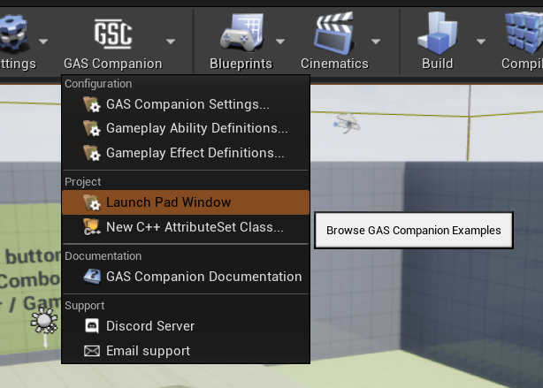
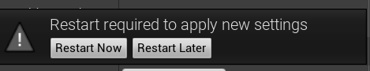
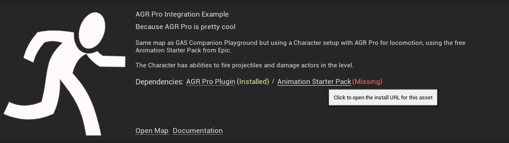

Introduced in 2.0.x version of the plugin, the Launch Pad Window can be used to browse and explore examples maps that demonstrates some features of GAS Companion.

**Credits** The Launch Pad Window is heavily inspired by [Dungeon Architect](https://www.unrealengine.com/marketplace/en-US/product/dungeon-architect) Launch Pad. Huge thanks to its author for creating such a high-quality and inspiring plugin.

## Access Launch Pad

You can open the Launch Pad Window using GAS Companion dropdown menu in the Level Editor toolbar: 

The first time opening the LaunchPad will grant you with this window:

Each example maps is managed in its [own plugin](https://github.com/GASCompanion/GASCompanionExamples), and can be enabled / disabled at will. You can use the `Install Plugin` button in this window to automatically download and install it as a project plugin.

At the end of the installation process, you'll need to restart your editor for the plugin to be available in the project and the LaunchPad window.

Once done, all the example maps should be available for you to explore:

## Example Maps

You can execute various actions on each examples

### Open Map

Open the map and freely explore the example scene. Some examples may have dependencies on other marketplace assets, in which case the Launch Pad will warn you and prevent the opening.

Each example map may rely on specific Project Inputs and / or GameplayTags. When you open the map, required inputs and GameplayTags are checked and if some are missing, you'll be granted with a dialog window asking you if it's okay to create those for you.

Same goes for custom Attribute Sets which might be required for some map (like CustomHUD example map). Before opening the map, you'll be asked if it's okay to update your GAS Companion projects settings to register custom AttributeSets that are required for the map (if any).

### Install Dependencies

Some examples rely on external assets from the marketplace (usually those made available for free by Epic Games like Paragon assets, or from other creators kind enough to provide free assets / plugins like AGR Pro). When the LaunchPad is opened, it will check if dependencies are installed and available in your project.

You can click the dependency link to open the asset URL on the marketplace from where you can download and install or import it in your project. In the case of Code Plugins (like AGR Pro), you'll need to first install the plugin in Engine, and then enable it in your Project's Plugin window (and restart the editor).

### Open Documentation

Browse the online documentation, if the example map has one.

