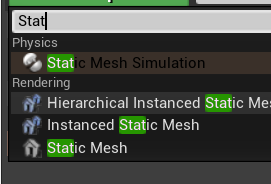
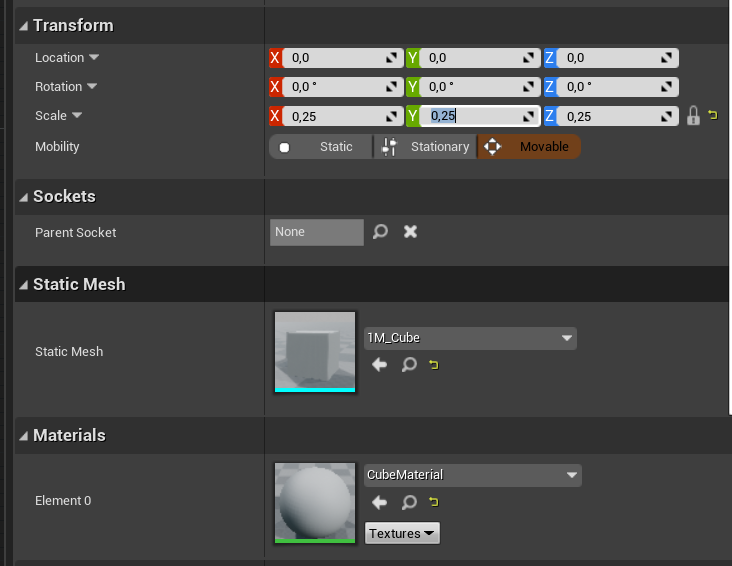
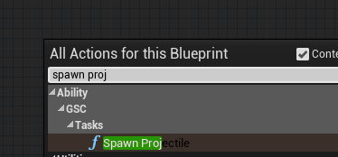
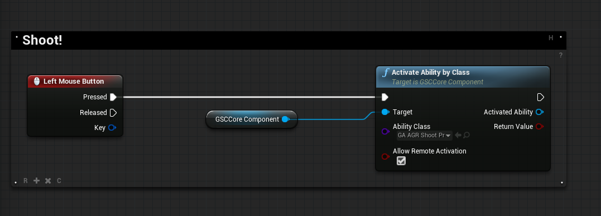

Introduced in 2.0.0 version of the plugin, [`GSCTask_SpawnProjectile`](/api/gsc-task-spawn-projectile) is a Gameplay Task you can use to spawn projectile in your abilities and quickly create projectile based abilities for your characters.

**Warning** *The projectile task has some quirks, and should be considered beta / experimental and will be revisited in future versions.*

Creating a new projectile ability requires the following steps:

- Create child blueprint from `GSCGameplayAbility`
- Implement the `ActivateAbility` logic
- Grant the Ability and activate it from your Character BP

## Create Projectile Ability

Right click in the Content Browser, and create a new `Gameplay > Gameplay Ability Blueprint` and choose `GSCGameplayAbility` as your parent class.

Name it with something that suits you.

## Create your Projectile Actor Blueprint

GAS has additional support for AbilityTasks that want to spawn actors. Though this could be accomplished in an Activate() function, it would not be possible to pass in dynamic "ExposeOnSpawn" actor properties. This is a powerful feature of blueprints, in order to support this, the projectile task accepts a `TSubclassOf<GSCProjectileBase>`.

The Spawn Projectile task works with `GSCProjectileBase` subclasses, you'll need to create a new Blueprint based on that class.

In this example, we're going to name it `BP_Projectile`.

Once the BP is created, the first thing we need to do is to setup the ProjectileMovement component in the BP construction script with the variables that were passed from `SpawnProjectile` Task.

In order to see anything, let's add a static mesh to our Projectile Actor.

In the details panel for the newly added Static Mesh, let's use a simple cube for now (if you have a better suited projectile mesh, feel free to use it instead) and scale it down a bit.

You may also want to edit the Collision profile for your static mesh, so that it doesn't block your own Character, let's use OverlapAllDynamic for now:

Next, let's that up by actually using it in our own Ability with SpawnProjectile Task.

## Implement ActivateAbility

In our Gameplay Ability Blueprint, let's start the implementation of `ActivateAbility`.

1. First, as usual, we commit the ability cost / cooldown (if any) and end the ability if the check fails.

2 We then make use of `SpawnProjectile` task, and using our custom `BP_Projectile` created previously. Before doing so, we need a reference to our Avatar Actor as a Pawn.

For good measure, let's add a debug print string in both `Success` and `Did Not Spawn` events for the task, before ending the ability.

**Result:**

***Note***: When using the SpawnProjectile task, you'll first see this:

Projectile parameters will only display "ExposeOnSpawn" actor properties once you fill in a valid `GSCProjectileBase` subclass.

## Adding Animation Notifiers to Montages

If you want to spawn the projectile at a specific animation frame, you'll need to send a gameplay event back to the owning actor.

It can be done with `AN_GSC_SendGameplayEventByTag` anim notifier.

When selected, the notifier details panel lets you configure the GameplayTag to use when sending the event

Then, in your Gameplay Ability Blueprint, you'll need to play that montage, wait for the Gameplay Tag event of your anim notifier, and trigger the spawning of the projectile when you receive the event:

## Activate Ability

The next step is to actually activate the ability from your Character Blueprints.

This can be done with Companion Core Component [ActivateAbilityByClass](/api/gsc-core-component/#activateabilitybyclass)

## Next Steps

The next steps you might want to consider is to handle collision for your projectile. It can be done in your Projectile Blueprint, where you may need to add a collision sphere, and handle the Collision Events (like Begin Overlap)

Maybe throw in some particles and other VFX / SFX as well. Remember that GameplayCues can be used for this.