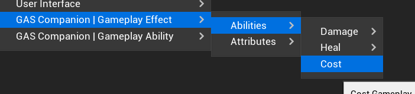
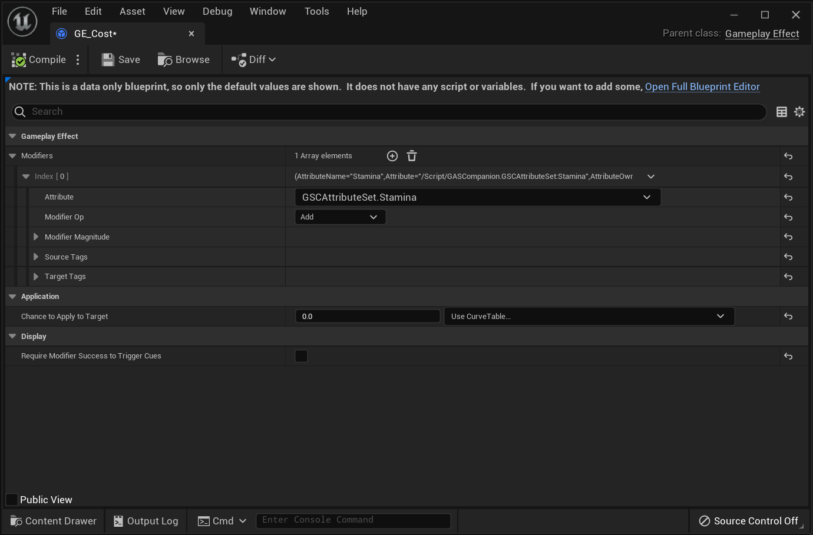
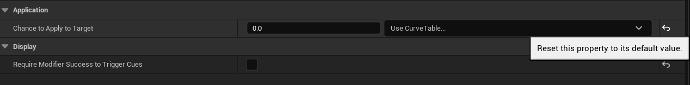
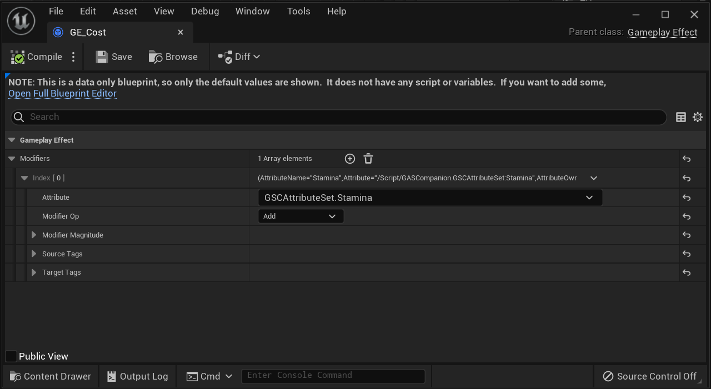

Current marketplace released version for ue5 (GAS Companion 5.0.0+5.0) is missing a little commit related to Gameplay Effect templates.

You are only concerned if you are creating Gameplay Effects Blueprint from context menu (described [here](/config-ge-definitions) - this page, as well as the whole documentation will be shortly updated for v5)

*5.0.1 version will be submitted to Marketplace later this week. I don't want to bother Epic Marketplace team more on a Sunday ... :)*

## Issue

Some of the GE Templates properties are not initialized properly, and are missing default values. This means that GE Blueprints created with them will have wrong default values for some of them.

## Solutions

### Fix and apply patch in C++

You can fix it by using the plugin as a project plugin and doing the following changes in the source code 

*(see this [gist](https://gist.github.com/mklabs/d121c9368533e9f428f2653daa710784) with a diff of the missing commit and the patch file you can apply if using git for the plugin source)*

Open up `Source/GASCompanion/Public/Templates/GSCTemplate_GameplayEffectDefinition.h` and add a default constructor:

```diff
class GASCOMPANION_API UGSCTemplate_GameplayEffectDefinition : public UObject
 	GENERATED_BODY()
 
 public:
+	UGSCTemplate_GameplayEffectDefinition();
 	
 	/** Policy for the duration of this effect */
 	UPROPERTY(EditDefaultsOnly, Category=GameplayEffect)

```
*Do not copy over the `+` sign at the beginning of the lines :)*

Open up `Source/GASCompanion/Private/Templates/GSCTemplate_GameplayEffectDefinition.cpp` and add the constructor body:


```diff
#include "GSCLog.h"
 
+UGSCTemplate_GameplayEffectDefinition::UGSCTemplate_GameplayEffectDefinition()
+{
+	DurationPolicy = EGameplayEffectDurationType::Instant;
+	bExecutePeriodicEffectOnApplication = true;
+	PeriodicInhibitionPolicy = EGameplayEffectPeriodInhibitionRemovedPolicy::NeverReset;
+	ChanceToApplyToTarget.SetValue(1.f);
+	StackingType = EGameplayEffectStackingType::None;
+	StackLimitCount = 0;
+	StackDurationRefreshPolicy = EGameplayEffectStackingDurationPolicy::RefreshOnSuccessfulApplication;
+	StackPeriodResetPolicy = EGameplayEffectStackingPeriodPolicy::ResetOnSuccessfulApplication;
+	bRequireModifierSuccessToTriggerCues = true;
+}
+
 void UGSCTemplate_GameplayEffectDefinition::CopyProperties(UGameplayEffect* CDO, UGSCTemplate_GameplayEffectDefinition* TemplateCDO)
 {
 	check(CDO);
```
*Do not copy over the `+` sign at the beginning of the lines :)*

### Manually fix GE Blueprints after creation

When you create a GE from template and context menu (for example, with the cost template)



Open up the newly created GE and enable `Show Only Modified Properties` (top right of the Blueprint editor)


You'll see only properties modified by the template (expected), and the few missing default values.



Here, the issue lies with `RequireModifierSuccessToTriggerCues` and `ChanceToApplyToTarget`.

Simply, click the little "Reset this property to its default value" button at the end of the row for each props (the one you can see in the constructor definition in Solution 1 section).



Compile and Save.

Gameplay Effect Blueprint with `Show Only Modified Properties` option enabled should now look like: 



### Solution 3

Wait for 5.0.1 to be published on the marketplace :)