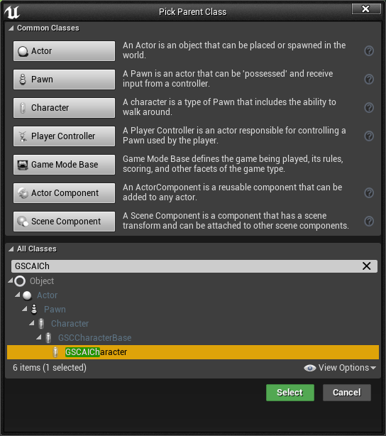
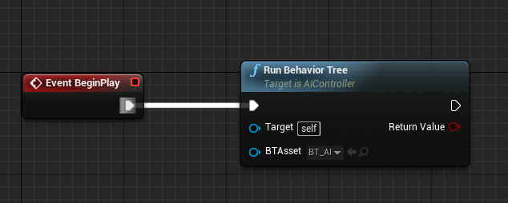

In this section, we'll go through very briefly on the usage of GAS and GAS Companion in the context of AI and Behavior Trees.

**Note This page still needs to be updated for v3. The main change here is about parent classes to use for AI Character (basically using `ModularCharacter` instead of `GSCAICharacter`)**

## Character / Controller Setup

### Character

For AI/NPC Characters that are intended to use Gameplay Abilities, they need to inherit from `GSCAICharacter`.

This class has all the necessary Gameplay Ability System setup (such as initialization of the Ability System Component and Attribute Set). `GSCAICharacter` differs from `GSCPlayerCharacter` by not relying on a PlayerState for GAS setup, and the ASC / AttributeSet are attached directly to the Pawn Character.

Create a new Blueprint Class with `GSCAICharacter` as a parent class (or re-parent your AI Character blueprint to use `GSCAICharacter`):

Once done, don't forget to configure your Character Abilities, Attributes and Effects if you have them, like we did in the [Quick Start section](/quick-start).

### AI Controller

To setup Behavior Tree, we need an `AIController` for this Pawn, from which we'll be able to run a Behavior Tree.

Create a new Blueprint with `AIController` as a parent class:

In this BP, simply run your Behavior Tree at some point (in either Begin Play or OnPossess)

Finally, update your Character Blueprint to use this `AIController`, in `Details > Pawn > AI Controller Class`: 

## Tasks

When you want to trigger abilities from BT, it is most likely done via Behavior Tree Tasks.

### Dealing with Finish Execute

Tasks need to notify the Behavior Tree that they have finished the execution of their task, which requires knowing when an ability ends.

To that end, GAS Companion `GSCGameplayAbility` exposes a `OnAbilityEnded` delegate you can bind an event to from within your BT Tasks.

You can decide to activate abilities either by Class, or by Tags. The latter providing a much more flexible way to deal with activation (Like trying to activate any ability with the Tags `Ability.Meleee` or `Ability.Range`)

GAS Companion provides both option as simple Blueprint-based Behavior Tree Tasks you can use directly.

### BTTask_UseAbilityByClass

If you want to activate a specific Gameplay Ability, you can make use of this task.

which exposes a single `AbilityToActivate` property

The Blueprint Graph for this task, if you would like to use your own Blueprint-based variation:

### BTTask_UseAbilityByTags

This one will try to activate an ability by tags.

A Gameplay Tag Container is exposed for you to specify from the Behavior Tree any number of tags to search for.

The task will search for all abilities matching the tag requirements, and try to activate a **single** one from one of the matching abilities (See [GSCAbilitySystemComponent::ActivateAbilityByTags()](/api/gsc-ability-system-component#activateabilitybytags)).

The Blueprint Graph for this task, if you would like to use your own Blueprint-based variation:

