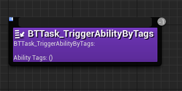

In this section, we'll go through very briefly on the usage of GAS in the context of AI and Behavior Trees.

When you want to trigger abilities from BT, it is most likely done via a Behavior Tree Task.

You can decide to activate abilities either by Class, or by Tags. The latter providing a much more flexible way to deal with activation (Like trying to activate any ability with the Tags `Ability.Meleee` or `Ability.Range`)

GAS Companion provides both option as simples native (implemented in C++) Tree Task you can use directly.

## Dealing with Finish Execute

Tasks need to notify the Behavior Tree that they have finished the execution of the task, which requires knowing when an ability ends.

To that end, GAS Companion `GSCGameplayAbility` exposes a `OnAbilityEnded` delegate you can bind an event to from within your BT Tasks.

## BTTask_UseAbilityByClass

If you want to activate a specific Gameplay Ability, you can make use of this task.

which exposes a single `AbilityToActivate` property

The Blueprint Graph for this task, if you would like to use your own Blueprint-based variation:

## BTTask_UseAbilityByTags

This one will try to activate an ability by tags.

A Gameplay Tag Container is exposed for you to specify from the Behavior Tree any number of tags to search for.

The task will search for all abilities matching the tag requirements, and try to activate a **single** one from one of the matching abilities (See [GSCAbilitySystemComponent::ActivateAbilityByTags()](/api/gsc-ability-system-component#activateabilitybytags)).

The Blueprint Graph for this task, if you would like to use your own Blueprint-based variation:

