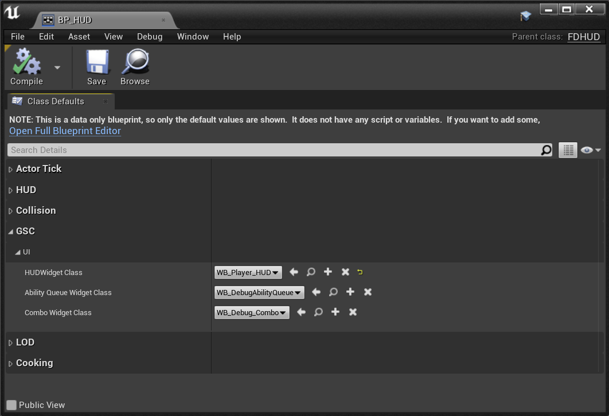
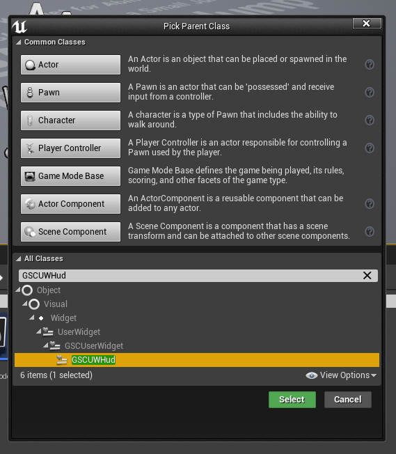

The plugin comes with a basic HUD UI and User Widgets set up to work with Characters Attribute from GAS.

They are driven by C++ with the PlayerState using [AttributeChangeDelegate](https://github.com/tranek/GASDocumentation#434-responding-to-attribute-changes) to update the HUD and respond to changes in Player Attribute values.

## Configuring HUD Widget

***Note:*** *You can change the HUD Widget Blueprint by creating your own HUD Blueprint (child of `GSCHUD`) and changing its `HUDWidgetClass` property. Also don't forget to update your GameMode to use your new HUD.*

GAS Companion provides three basic HUD Widget Blueprint for demonstration purpose:

- `WB_HUD` Default Widget as seen in the above picture
- `WH_HUD_TopLeft` Same Widget but with a slight variation in the positioning of the attributes progress bar
- `WB_HUD_Minimalist` Another HUD variation, this time with a minimalist feel

### WB_HUD

### WB_HUD_TopLeft

### WB_HUD_Minimalist

*Icons licensed under CC BY 3.0 ([game-icons.net](https://game-icons.net/) - authors: Skoll, [sbed](https://opengameart.org/content/95-game-icons) and [Delapouite](https://delapouite.com/))*

## Designing your own Widget

Regarding UI, GAS Companion tries to follow the [Logic in C++, Visuals in Blueprints](https://benui.ca/unreal/ui-best-practices/#logic-in-c-visuals-in-blueprints) recommendation.

That's why the three Widget Blueprints we saw earlier all inherit from `UGSCUWHud` which is responsible for all the logic, and uses several `meta=(BindWidget)` UPROPERTY to communicate with Blueprints.

If you create a Widget Blueprint with `UGSCUWHud` as a parent class (*Right Click in Content Browser > Blueprint Class > GSCUWHud*)

And open the widget, you'll see a bunch of warnings

Those are all the `meta=(BindWidgetOptional)` UPROPERTY `UGSCUWHud` is using to update the UI. You just need to create the appropriate Widget with the exact same name in your UserWidget hierarchy.

Once defined, all the warnings will disappear and your newly created HUD should be fully functional.