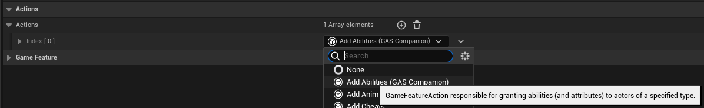
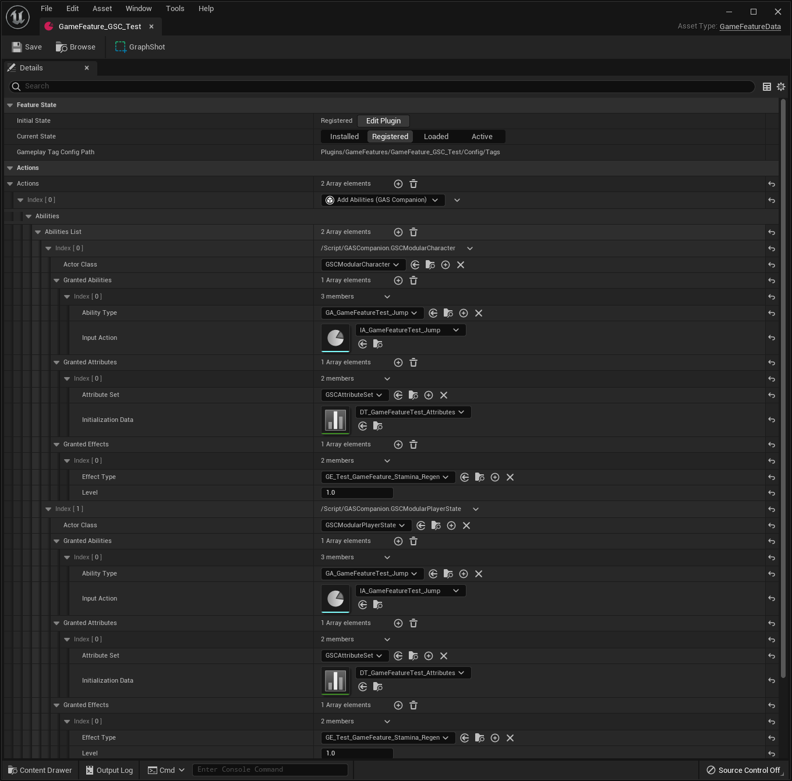
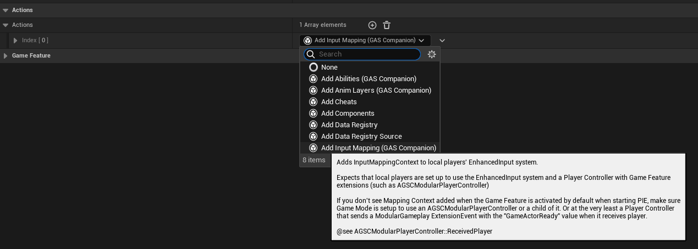
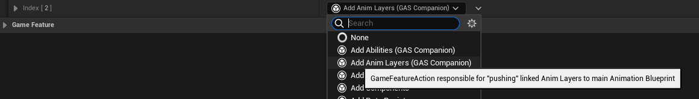
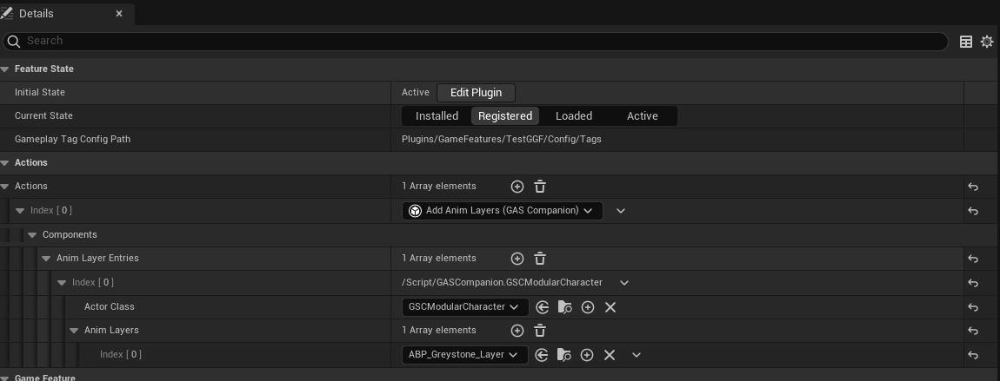

## Game Feature Actions

GAS Companion provides the following "Actions" that can be used from Game Features data assets.

{{ collections.all | eleventyNavigation("GameFeatures/Actions") |  eleventyNavigationToMarkdown({ showExcerpt: true }) | safe }}

### Add Abilities

`Add Abilities` can be used to grant abilities / attributes, when the feature is enabled and removed when the feature is disabled.

The action definition is really similar to the one found in GAS Companion's ASC (when you define and grant abilities / attributes from Pawn or PlayerState class default with ASC selected)

### Add Input Mapping

`Add Input Mapping` lets you add an Enhanced Input mapping context when the feature is enabled, and remove the context when the feature is disabled.

This is useful to provide additional input mappings specific to a Game Feature. The priority can also be used (with a value higher than the mapping context previously added in the game code - Pawn or PlayerController) to override or take over a key input when the feature is enabled.

It works in tandem with `Add Abilities` and the ability input binding (when an Ability is granted alongside an Input Action)

### Add Anim Layers

`Add Anim Layers` is a small Game Feature Action that lets you "link" anim instance layers when the game feature is enabled, and "unlinked" when the feature is disabled.

This is useful if your Pawn's main Anim Blueprint is setup to be extended by anim layers, with extension points that a game feature can implement.

Internally, when the feature is enabled, `LinkAnimClassLayers()` will be called on owner's Skeletal Mesh Component, and `UnlinkAnimClassLayers()` when the feature is disabled.

