This upgrade guide is mostly geared towards 2.x users willing to upgrade from 4.26 to 5.0 (or 4.27 users still using deprecated classes / API)

Most noticeable change for 4.27 users is related to the `ReceiveCharacterRestarted` / `ReceiveCharacterControllerChanged` events (See GSCPlayerCharacter section 6.)

**Note**: See [this page](/v5/upgrade-guide/cpp) for C++ upgrade guide (eg. if your cpp backend is using some of GAS Companion classes).

**Summary**

- All deprecated classes and API have been removed
- Most classes, removed or renamed, are handled via class redirects (example: a Blueprint previously created using `GSCPlayerCharacter` as a parent class will now use `GSCModularCharacter` and won't need to be reparented or recreated)
- Runtime modules have been consolidated into a single one. `ModularGASCompanion` module has been removed and all classes from that module moved to `GASCompanion` module.
- All MGC prefixed classes have been renamed and now prefixed with GSC.
- `ModularGASCompanionEditor` module removed. Only existed to backport ue5 functionality related to Game Features (now handled in engine directly)

<div class="notes">

Note on future releases and versioning:

- 5.0.0 version for GAS Companion will match UE 5.0 official release with UE 5.0 as a target platform. All classes marked as deprecated since 3.0.0 are removed in this version.
- 4.0.0 version for GAS Companion will be the equivalent of 5.0.0, but for 4.27. Deprecated classes removal and API will happen at that moment (and will probably de delayed until UE 5.1 hits).

</div>

## Config

If you converted your project from 4.27, you can remove these lines from `DefaultGame.ini`:

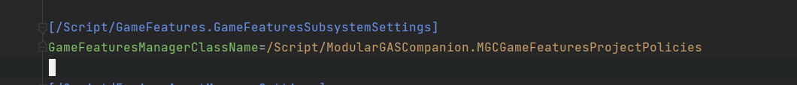

This class has been removed and was only used in 4.27 to backport ue5 functionality regarding Game Feature Data assets, now done in the engine directly.


## Actors

### GSCPlayerCharacter

*redirected with class redirects to GSCModularCharacter*

1. Open Blueprint, and you'll most likely have BP compilation errors about missing "GSCCoreComponent"
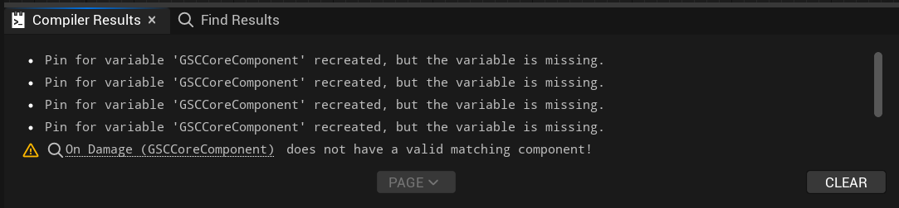

1.1 Add `GSCCore` from the component list manually
    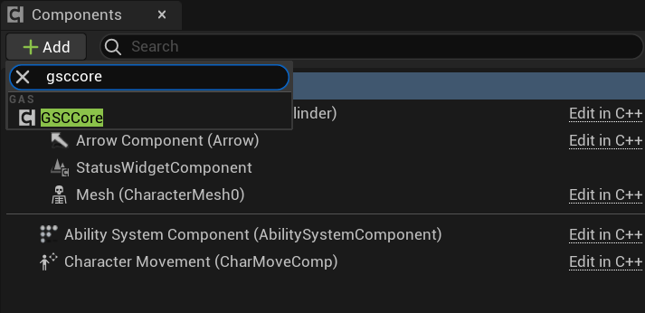

1.2 - Rename component to `GSCCoreComponent` like it was named before
    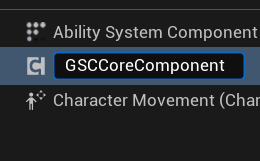

- Compile Blueprint
- All previous compilation errors should now be gone and Unreal should update node reference to prev component to new component
- Steps to reproduce for `GSCComboManager` and `GSCAbilityQueueComponent` if you were using them:
    - Add `GSCComboManager` from components list and rename it to `GSCComboComponent`
    - Add `GSCAbilityQueueComponent` from components list and rename it to `GSCAbilityQueueComponent` (rename if needed, name should be the same)

2. Default "startup" Abilities / Effects are not managed through GSCCoreComponent, but via Ability System Component subclass (`GSCAbilitySystemComponent`)
    - With your backup copy of the project opened on the side, configure `AbilitySystemComponent` details panel "GAS Companion > Abilities" category with Abilities / Effects that were previously granted via GSCCoreComponent Startup Abilities / Effects.
    - Additionally, grant here any Attribute Sets you want your character to use (it was previously done "globally" in Plugin Settings for GAS Companion)
        - ***Note* Especially important if your abilities are using those attributes (for instance for costs). Upon ability activation for instance, an ability checking for a cost attribute not granted will crash the engine**
    - About attributes, if you were using a Gameplay Effect to initialize default values, you can still do it with `Granted Effects` list, or (recommended) use the Initialization Data property with a Datatable (row structure: AttributeMetaData)

Example: if your previous configuration for GSCCoreComponent was looking like this: 
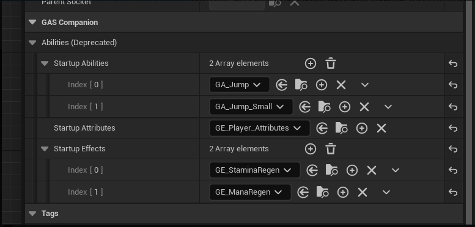

It needs to be converted into the following configuration for `Ability System Component (GSCAbilitySystemComponent)`

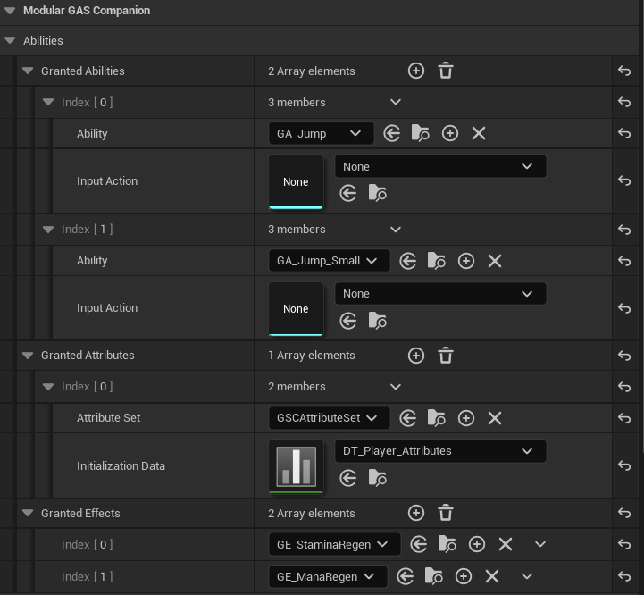

3. The other difference between `GSCPlayerCharacter` and `GSCModularCharacter` is that `GSCModularCharacter` is setting up the ASC on Pawn, and `GSCPlayerCharacter` used to managed that through Player State. If you want to keep that functionality (ASC on Player State):
    - reparent your Character to `GSCModularPlayerStateCharacter`
    - Make a child Blueprint of `GSCModularPlayerState` and configure Ability System Component subclass (`GSCAbilitySystemComponent`) like you would do in step 2.
    - Make sure to update your Game Mode(s) to use your child Player State class Blueprint.

4. `GSCPlayerCharacter` also sets up sensitive defaults for the Character and Mesh Component, that you can redo in Blueprints. This include:

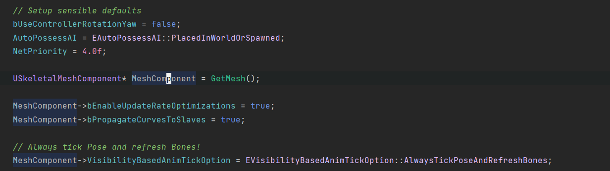
*For each of these settings, look for them in the Blueprint Class defaults and update the value like it was before. For Mesh Component, select the Mesh in the component list and update details panel*

5. if you were using `GetASC()` method to get a hold of your Ability System Component, you need to convert the code to use `UAbilitySystemBlueprintLibrary::GetAbilitySystemComponent()` passing self for the Actor pin.

from:

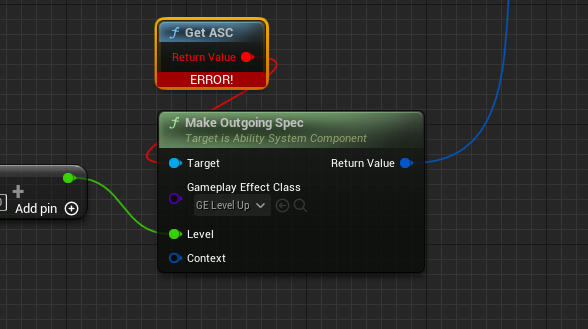

to:

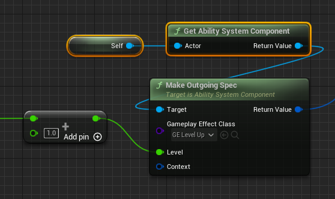

6. If you were using `ReceiveCharacterRestarted` or `ReceiveCharacterControllerChanged` events or delegates, replace them with `ReceiveRestarted` and `ReceiveControllerChanged`. Those were added in 4.27 as backport of ue5 code, and now added in the engine by default (in `APawn`).

### GSCAICharacter

*redirected with class redirects to GSCModularCharacter*

1. Same Step as `GSCPlayerCharacter` 1. section
2. Same Step as `GSCPlayerCharacter` 2. section
3. Maybe setup ASC replication Mode to Minimal for AI Characters (in Character Class defaults): 

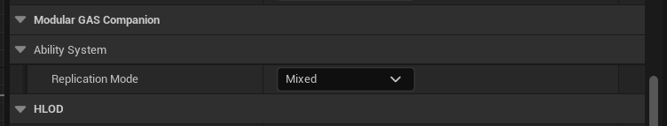

4. Same step as `GSCPlayerCharacter` 4. / 5. / 6. section

### GSCDefaultPawn

*redirected with class redirects to GSCModularDefaultPawn*

1. Same Step as `GSCPlayerCharacter` 1. section
2. Same Step as `GSCPlayerCharacter` 2. section
3. Same Step as `GSCAICharacter` 3. section

### GSCActor

*redirected with class redirects to GSCModularActor*

1. Same Step as `GSCPlayerCharacter` 1. section
2. Same Step as `GSCPlayerCharacter` 2. section
3. Same Step as `GSCAICharacter` 3. section

### GSCPlayerController

*redirected with class redirects to GSCModularPlayerController*

1. No particular step to do.

### AGSCHUD

*redirected with class redirects to AHUD (Engine Class)*

* AGSCHUD is no longer used by GASCompanion and is removed in v4 (for UE 4.27) / v5 (for UE 5.0) (v4 scheduled release when UE 5.1 hits)
* If you were using it from your Pawn Blueprints to create / show / hide it:
  * To create HUD UMG widget, simply Create Widget from Pawn `Receive Restarted` event (or BeginPlay for Single Player games) and add it to viewport (and optionally store a reference to the created widget).
  * Show / Hide it based on stored widget variable and its visibility (Hide: RemoveFromParent, Show: Add to viewport)
* If you were using it to show / hide debug widgets (Ability Queue / Combo), you can use `GSCConsoleManagerSubsystem` instead.


## Game Mode

### AGSCGameModeBase

*redirected with class redirects to GSCModularGameModeBase*

1. No particular step to do. Your BP subclass for this GameMode should already override gameplay framework specific classes suited for your game. GSCModularGameModeBase (as well as removed GSCGameModeBase) doesn't provide any logic and only sets up default classes, which should be already overridden in Blueprint to match your game specific classes.

## Attribute Sets

1. If you generated your custom attributes with GAS Companion Attribute wizard before 3.1.1 version (09/12/2021), you'll need to edit your `PostGameplayEffectExecute` method from:

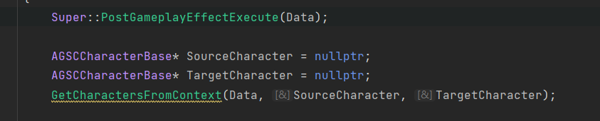

to:

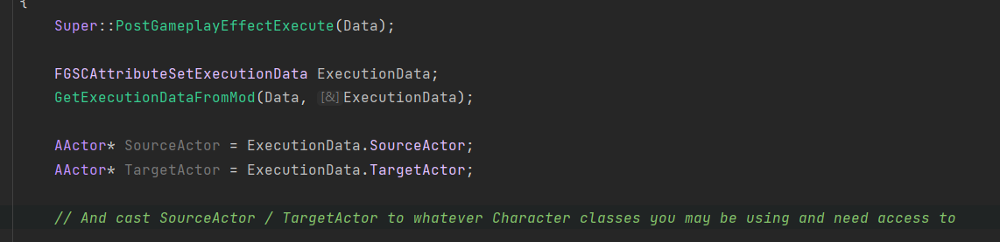

```cpp
    Super::PostGameplayEffectExecute(Data);

    FGSCAttributeSetExecutionData ExecutionData;
    GetExecutionDataFromMod(Data, ExecutionData);

    AActor* SourceActor = ExecutionData.SourceActor;
    AActor* TargetActor = ExecutionData.TargetActor;

    // And cast SourceActor / TargetActor to whatever Character classes you may be using and need access to
```

or even remove those lines within `PostGameplayEffectExecute` if you don't use Source / Target character or don't implement any attribute related logic here in cpp.


2. Remove `GSCCharacterBase` include:

```cpp
#include "Actors/Characters/GSCCharacterBase.h" // remove this line
```